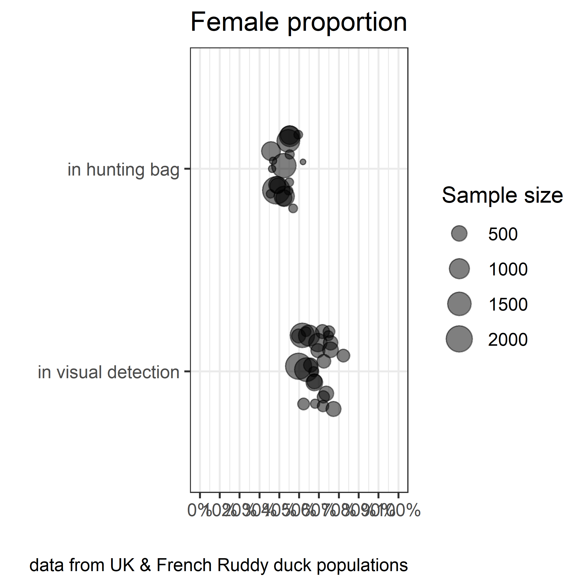
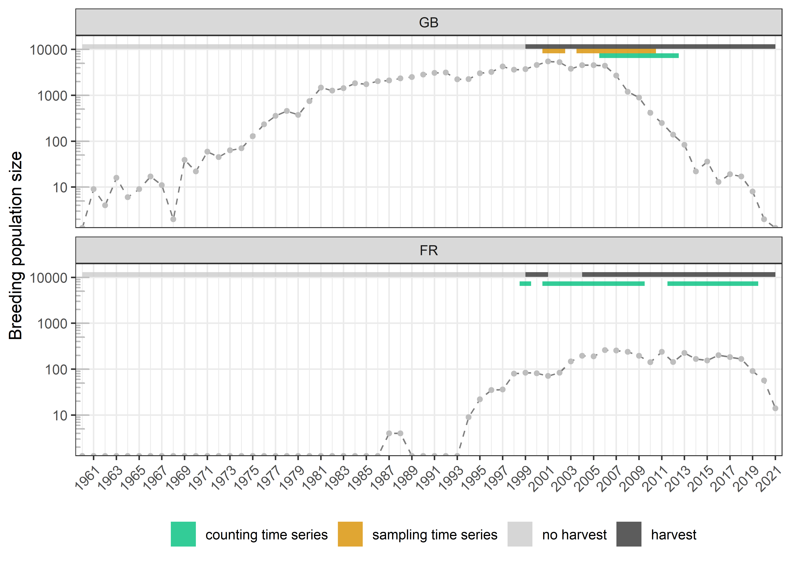
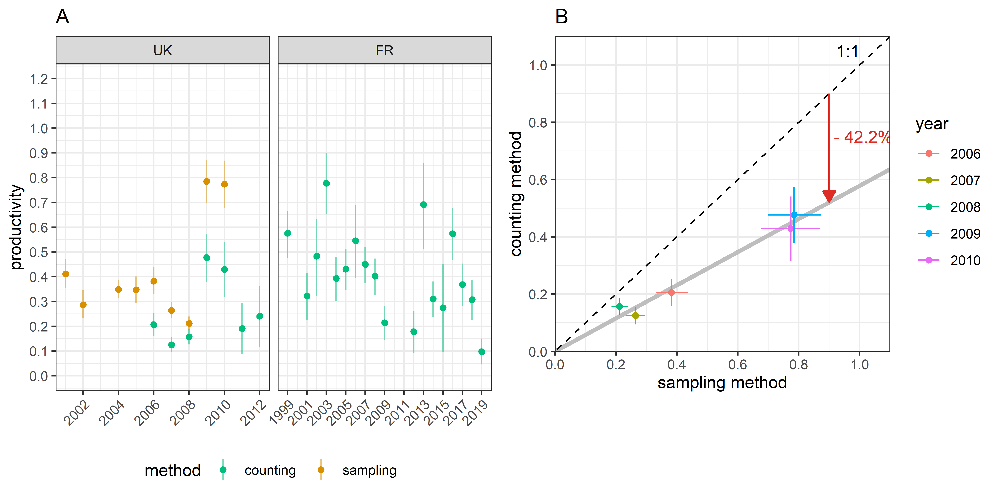
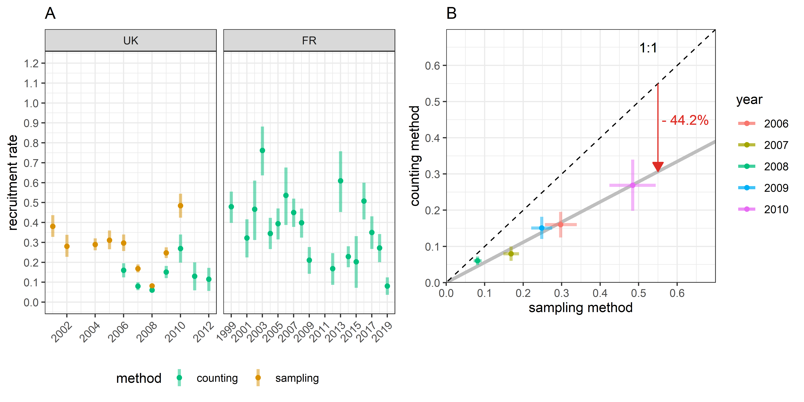
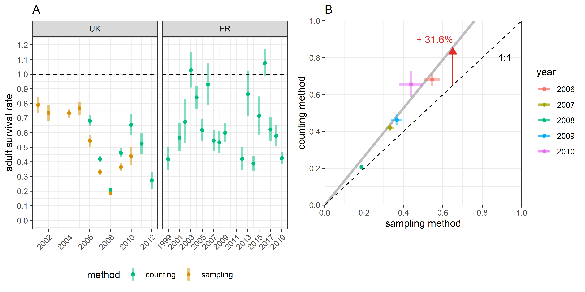
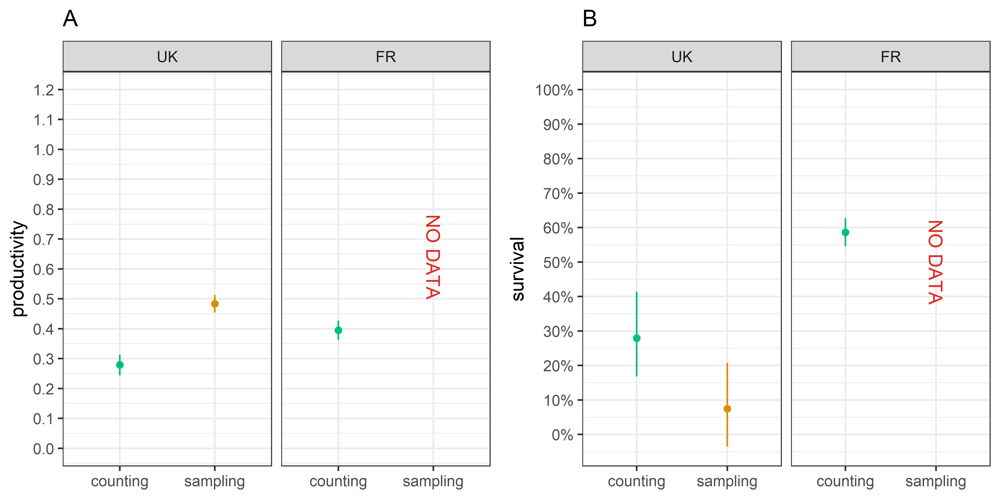
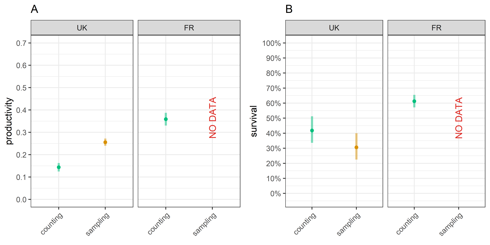
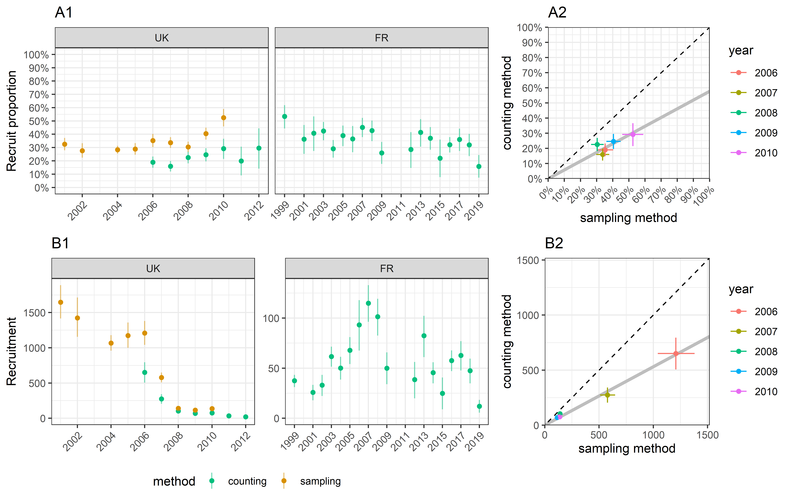
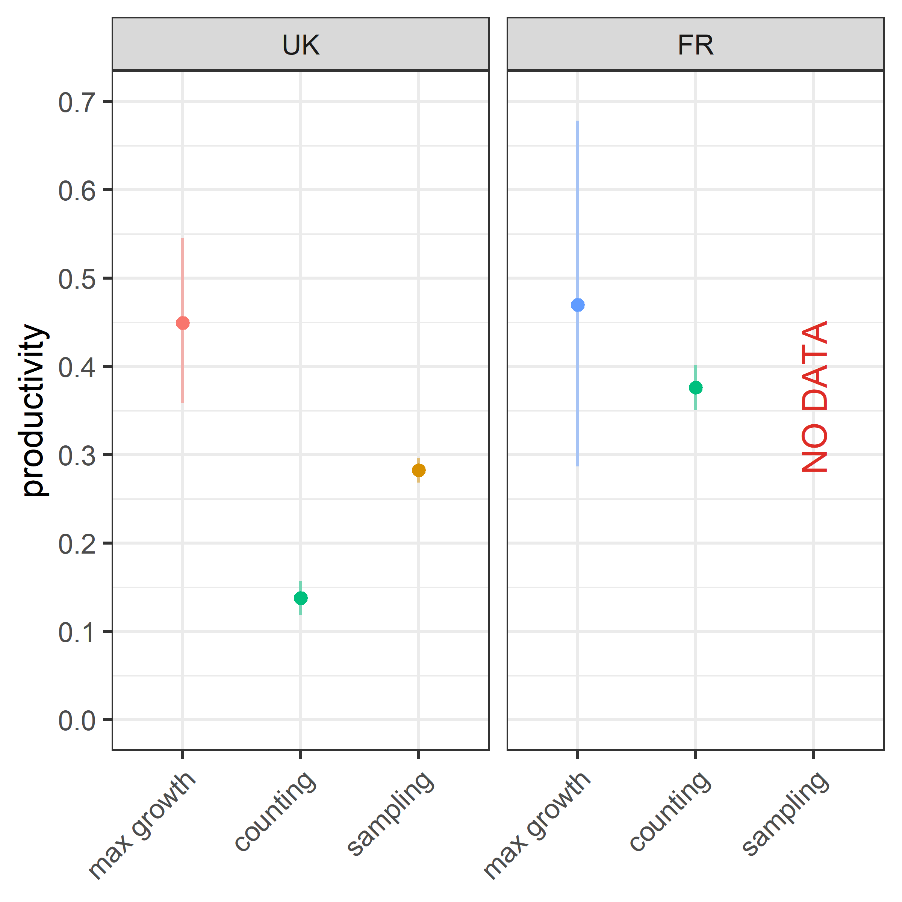

```{r setup, include=FALSE}
knitr::opts_chunk$set(echo = FALSE, 
                      warning = FALSE, 
                      message = FALSE, 
                      out.width = "100%", 
                      fig.align = "center",
                      fig.pos = 'H') # hold position

Sys.setlocale("LC_ALL", "English")

```

\newpage

# Introduction

*Definitions*

One defines the recruitment rate of a breeding population as the average number of recruits produced per each breeder [@Flint2015]. This parameter might sometimes be called "annual fertility" [@Koons2014], "fecundity" [@Arnold2018], "reproductive rate" [@Cooch2014], "reproductive success" [@Etterson2011], or "productivity" [@Johnson1987; @Hagen2008]. If one considers a species reaching its sexual maturity as early as its first year, all individuals are mature at the reproduction season. The recruitment rate is thus the ratio of the number of young adults at the reproduction season of year $t$, i.e. the recruits, to the number of all individuals at the reproduction season of the previous year, $t - 1$. The declination for species with age at first reproduction higher than 1 follows the same process [see @Robertson2008]. 

The recruitment rate parameter is complex because it is composed of two main sub-parameters : the fecundity followed by the juvenile survival [@Etterson2011]. Both sub-parameters can be split into other sub-parameters. The fecundity can be defined by the product of the nesting success, the average clutch size, and the hatching success. The juvenile survival can be defined as the product of the post-hatching survival and the post-fledging survival, both critical life periods [@Hill2008; @Blums2004]. The recruitment rate as defined in the present study is thus a parameter integrating multiple life steps from the egg to the young adult attempting to breed for its first time [@Koons2017]. 

*The use of recruitment rate in population management*

Population conservation, harvesting, and control require tools in population management to reach targets such as a population size for example [@Shea1998]. To do so, a first "blind" strategy is to test iteratively management rules to reach progressively an optimum. Such approach can be time-consuming given the intrinsic variability of the population response to its changing environment. It might also suffer from a rejection of the stakeholders because of the lack of transparency of an arbitrary process [@Williams2013]. Another approach is to try to predict the growth rate of the population as a function of the harvest rate and other environment inputs. Such modelling approach can provide clues on the recovering time of a population upon a variety of management rules [@Otis2006]. These decision-support tools are then key inputs to status on the best management rules to implement. The growth rate of a population depends on the adult survival and the recruitment rate, see Equation \@ref(eq:GR) in Section \@ref(PGR). The adult survival is generally estimated by mark recapture/recovery methods [@Lebreton2001]. If the harvest pressure behaves as an additive mortality to the natural mortality for adults [e.g. @Iverson2013], it is quite straightforward to predict its impact on the adult survival. 

According to @Blums2004, the recruitment for diving ducks is poorly related to fecundity, but depends mostly on juvenile survival, which is driven by weather conditions. Studies on other birds concludes also on the weak correlation between fecundity and recruitment [e.g. @Murray2000]. The difficulty to track juvenile survival [@Schmidt2008] demonstrates the interest to focus on the recruitment rate when accessible. The key to predict the growth rate of a population is then to estimate the average value and the variability of the recruitment rate, potentially influenced by the harvest pressure [@Anders2005]. 

*The variability of the recruitment rate*

A waterfowl species that is released in a favourable habitat will naturally expand  [@Malthus1872]. The growth of such a population reflects that the recruitment rate parameter is higher than the adult mortality rate. This expansion is limited by the carrying capacity of the habitat [@Sayre2008]. When a waterfowl species is endemic of an ecosystem and evolves in stable environmental conditions, the population size varies around the carrying capacity because the individuals compete for space or/and food [@Nummi2015], which prevents the population from expanding. This competition commonly induces a lower fecundity or/and a higher juvenile mortality. The population renewal is slowed down because the recruitment rate parameter is affected by density-dependent effects [@Gunnarsson2013]. For an endemic species evolving in stable environmental conditions, a balance between the recruitment rate and the adult mortality rate explains the stabilization of the number of individuals [@Flint2015].

Hunting waterfowl induces adult and juvenile mortality [@Bellrose1980]. Intuitively, one expects that such a hunted population would observe lower adult survival and recruitment rate and then would rapidly deplete to its extinction. However, hunting waterfowl has a long history, and most of these species have persisted over time [@Cooch2014]. So paradoxically, hunting immature individuals does not always induce a decrease of recruitment rate. The heterogeneity of quality among immature individuals might explain this by inducing a compensation process if the harvest selects mostly individuals with a low reproductive potential [@Lindberg2013; @Gimenez2017]. The recruitment rate can even be enhanced because the harvest pressure reduces the densities and potentially the competition for space and food [@Nummi2015; @Peron2012]. In conclusion, a limited exploitation of a population observing heterogeneity and/or density-dependent effect might increase or at least not affect the recruitment rate. Under moderate exploitation, a new balance between adult mortality and recruitment rate can be theoretically reached [@Tsikliras2018]. The size of a newly exploited population in stable environmental conditions should thus reach a different equilibrium, which is expected to be lower than the size without exploitation. This process explains why the exploitation of many waterfowl species is sustainable and has been lasting over a long time. 

The fecundity and the juvenile survival, the two components of the recruitment rate, are very sensitive to weather conditions [@Blums2004; @Folliot2017]. The environment conditions are thus an additional source of variability of the recruitment rate. The response of the recruitment rate to a harvest pressure is thus not straightforward. It is noisy because of its sensitivity to environmental factors. It also depends directly on the intensity of harvest on the immature individuals and indirectly on the mitigation of the density-dependent effects.

*What part of the recruitment rate gradient is necessary for population management?* 

In population management, a common question for a threaten or an invasive species is to determine the measure that will allow to reach a targeted population size/density in a limited time period [@Shea1998]. For such question, the carrying capacity of the habitat is theoretically not reached. So a manager should mostly focus on collecting knowledge on the maximum recruitment rate and its variability by removing the potential density-dependent effects occurring only for the highest theoretical densities [@Peron2013, @Eraud2021].

*What is the ideal biological model to explore the gradient of the recruitment rate?*

Hunting waterfowl has a long history, but the biological effects of long-term moratorium have been poorly surveyed [@MartinezAbrain2013]. So there are few opportunities to explore the response of the recruitment rate to a gradient of pressure for such species. Alien vertebrate species are commonly introduced during release events [@Saul2016]. They usually observe a first period of colonisation on new territories without management measures. Since its presence might impact the balance of the colonized ecosystem, it happens that managers take strong control measures to restrict the growth of these populations or to eradicate them [@Oficialdegui2020]. Such species are then a good biological model to overcome density-dependent effects and explore the effects of a harvest gradient on recruitment rate.  

*How to estimate recruitment rate?*

The recruitment rate parameter of a population can be assessed first by evaluating the fecundity of the breeding population and then by monitoring the survival from the egg life stage to the first-breeding event. To do so, it is necessary to monitor nests in habitats representative of the managed population [@Blums2004]. The survival of a chick to its recruitment can be done by capture mark recapture method quite tricky to set up [@Blums2004; @Schmidt2008, @Arnold2018]. Even if such approach provides valuable information on the dynamics of the recruitment and can highlight the bottlenecks, the fieldwork required to estimate both components is too time-consuming to generalize such approach for waterfowl population management on a long-term horizon. 

In waterfowl, it is generally impossible to differentiate immatures from adults without examining birds in hand. Aging individuals from samples coming from hunting bags is thus another opportunity to estimate the recruit proportion. Such approach suffers from two caveats. First, it is impossible to assess the recruitment rate when there is no harvest whereas it is necessary to predict what would happen if a moratorium seems required to allow a population to recover, or to calibrate a priori the harvest effort necessary to control an invasive species [@Smith2005]. Secondly, like any predation action, hunting is selective and provides a biased picture of the population age structure in favour of the immatures [@Bellrose1980; @Fox2014]. The hunting bag analysis might then lead to overestimate the recruitment rate and consequently the maximum sustainable harvest rate, with adverse consequences on population conservation [@Fox2014].

Alternative method: trapping methods but still biased @Arnold2018
Finally, because juveniles are more naïve, they may be more vulnerable to capture by
standard trapping methods (Rguibi- Idrissi et al., 2003), even if loca-
tions and timing were otherwise unbiased.

In waterfowl, it is common that adult males display brighter colours than adult females and immatures of both sexes, which display cover-up plumage similar to adult females [@Johnson1999]. This discrepancy is valuable because it can be observed and quantified from distance. Knowing adult sex ratio, such approach is promising because it requires only to count the proportion of birds of the two plumage kinds to infer the recruitment rate [@Smith2001]. Unlike the two previous methods, this one is non-invasive and requires an acceptable time investment, which allows to collect long time series and consequently to track recruitment rate variability.

*Methodology of this study*

From two populations of ruddy duck, an species introduced in Europe in the 40's, this study introduces a simple Bayesian model to infer recruitment rate from count data. A large part of this study focuses on assessing the viability of such approach. A comparison to the results of the common approach using samples from hunting bags aims at checking if the recruitment rate variability is well tracked and if the hypothesis of the recruitment rate overestimation by sampling methods is consistent with the results. Using two other approaches using average population growth rates, one testes the consistency of the order of magnitude of the recruitment rate estimated from the counting method. 

# Materials & methods {#MM}

## Biological model

The ruddy duck is a diving duck species introduced in the United Kingdom in the 40's [@GutierrezExposito2020]. The first reproduction was observed in the 60's. The population rapidly grew to reach more than 5000 individuals spread over the entire country. A new population set up in France from the 90's, likely because of an arrival of a few individuals from the United Kingdom (UK). Unlike the UK population, the French one set up around a single wintering spot, the Grand Lieu Lake (47.09°N, 1.67°W). Since this species is considered as a threat to the white-headed duck because of the risk of genetic introgression [@MunozFuentes2007], an European plan of eradication has been adopted and control measures were taken in both countries [@GutierrezExposito2020]. 

Just before the reproduction period, one can distinguish from shore individuals with male-like plumage from female-like individuals on wintering spots (Figure \@ref(fig:MM1)). It is noticeable that the apparent proportion of males in the counts from shore is far below the proportion of males in the samples from hunting bags (Figure \@ref(fig:MM2)). 

```{r MM1, fig.cap = "(ref:MM1cap)"}
knitr::include_graphics("../Output/flock.png")
```

```{r MM2, fig.cap = "(ref:MM2cap)"}

```

Since sex identification of samples is very accurate, such observation demonstrates that the counting method misses the identification of a significant part of males in the population. In many waterfowl species, immature individuals of both sexes display cover-up plumage similar to adult female plumage [@Reeber2015]. Consequently, the counts in winter allows adult males to be distinguished from all other individuals (adult females, immature females, and immature males). This property can be valuable to estimate the recruitment with a few conditions. The season when adult males can be distinguished from all other individuals is sufficiently close to the breeding period to consider the age structure picture of the population to be representative of the age structure of the breeding population^[immature survival equal to adult survival [@Arnold2018]]. The adult sex ratio is known and stable over the considered time period. 

The demography of both ruddy duck populations has been tracked thanks to exhaustive counts on the wintering spots during the period between December 1 and January 31. Controlled individuals between the counting date and the beginning of the reproduction period (set up to May 1 upon field observations) were subtracted from the winter count to get a proxy of the breeding population size. The two populations follow similar demographic histories (Figure \@ref(fig:MM1)). They grew freely in both countries until 1999. Limited control measures have been then applied from 1999 to 2005 in the UK and from 1999 to 2018 in France. In both countries, these management measures led to stop the expansion of the ruddy ducks. From 2005 in the UK and from 2018 in France, higher control effort led to a rapid depletion in both populations. This history underlines that both populations observed a large spectrum of harvest effort, from no pressure to very high pressure. For sake of interpretation, the time period 2001-2004 was classified in the "no harvest" category in France because the harvest pressure applied over this period was very limited with no effect on the population growth.

```{r MM3, fig.cap = "(ref:MM3cap)"}

```

The counting dataset, which differentiates the male-like from the female-like individuals in winter, covers 7 years and 19 years in UK and France respectively (Figure \@ref(fig:MM3)). Combined together, the counting datasets cover different population dynamics corresponding to a large harvest pressure spectrum. In France, data before 2004 correspond to a period of population growth with (almost) no harvest pressure, whereas data in the following years correspond to a stabilized population size with a significant level of harvest pressure (Figure \@ref(fig:MM3)). In UK, the counting data correspond to a quick population depletion associated to a high level of harvest pressure, especially before the reproduction period. In parallel, the sampling dataset, which corresponds to individuals shot in winter during control operations, covers 9 years only in UK, with 5 years in common with the corresponding counting time series.

## Recruitment rate inference from count data

Adult sex ratio in waterfowl is generally biased towards males (Figure \@ref(fig:MM2), @Wood2021). As a consequence, deducing the immature proportion from the adult male proportion is not straightforward because the adult female proportion is not just equal to the adult male proportion. Even if the adult sex ratio may vary over a long time range, it is relatively stable over a few years [@Wood2021]. Sex identification in adult samples from hunting bags was available for both ruddy duck populations. However, the small population size in France was limiting to provide useful sex proportion estimates. A comparison over months in UK showed no difference in male proportion, so adult samples collected over the whole year were used to estimate the male proportion. A comparison of male proportion among years with more 500 samples did not show significant differences among years. As a consequence, all adult samples were pooled to estimate the adult male proportion, see Equation \@ref(eq:pm). 

From the cumulated counts of male-like individuals in the wintering population, the proportion of immature individuals can be deduced following Equation \@ref(eq:pic). Only years with more than 100 individuals were selected. From this proportion and abundance index of breeding population sizes, the recruitment rate is straightforward, see Equation \@ref(eq:r). If the absolute value of the breeding population size is accessible, the recruitment can be estimated, see Equation \@ref(eq:R).

|Name|Class|Description|
|:--|:----|:----------------------------|
|$pm$|Parameter|Proportion of males in the adult part of population at its equilibrium|
|$SM$|Data|Total number of adult males in samples|
|$SF$|Data|Total number of adult females in samples|
|$CM_{i, t}$|Data|Cumulated number of type-male individuals counted in population $i$ in year $t$|
|$pi_{i, t}$|Parameter|Proportion of immature individuals in population $i$ in year $t$|
|$C_{i, t}$|Data|Cumulated number of individuals counted in population $i$ in year $t$|
|$R_{i, t}$|Parameter|Number of recruits in population $i$ in year $t$|
|$N_{i, t}$|Data|Maximum number of individuals counted in the wintering population $i$ in year $t$ minus removals before reproduction (proxy of the breeding population size)|
|$r_{i, t}$|Parameter|Recruitment rate, i.e. number of recruits in population $i$ in year $t$ per breeder in year $t - 1$|

\begin{equation}
pm \sim {\sf Beta}(SM, SF)
(\#eq:pm)
\end{equation}

\begin{equation}
CM_{i, t} \sim {\sf Binom}(pm.(1 - pi_{i, t}), C_{i, t})
(\#eq:pic)
\end{equation}

\begin{equation}
r_{i, t} = \frac{pi_{i, t}.N_{i, t}}{N_{i, t - 1}}
(\#eq:r)
\end{equation}

\begin{equation}
R_{i, t} = pi_{i, t}.N_{i, t}
(\#eq:R)
\end{equation}

## Comparison with the sampling method

A direct estimation of the immature proportion can be done using samples from the hunting bag, see Equation \@ref(eq:pis). By combining estimates of immature proportion and Equation \@ref(eq:r), annual recruitment rates from samples were estimated to assess their consistency with the counting method. One selected only years with more than 100 individuals controlled in winter, which correspond to a 9-year period in UK. This sampling time series covers 5 years of the UK counting time series. 

|Name|Class|Description|
|:--|:----|:----------------------------|
|$SI_{i, t}$|Data|Number of immatures sampled in the wintering population $i$ in year $t$|
|$S_{i, t}$|Data|Number of individuals sampled in the wintering population $i$ in year $t$|

\begin{equation}
SI_{i, t} \sim {\sf Binom}(pi_{i, t}, S_{i, t})
(\#eq:pis)
\end{equation}

## Result validation using population growth rates {#PGR}

The simple relationship (a bit more complex if one considers a species with delayed maturity [see @Robertson2008]) between population growth rate, adult survival, and recruitment rate can be used to test the accuracy of the order of magnitude of recruitment rates estimated from the counting and the sampling methods, see Equation \@ref(eq:GR). This relationship comes from a simple reasoning for a closed population : the population size in year $t$ is equal to the number of breeders that survived over year $t - 1$ plus the offspring produced in year $t - 1$ that survived until the reproduction period of year $t$, i.e. the recruitment in year $t$. The growth rate of a population is thus the sum of the adult survival rate and the recruitment rate [@Flint2015].

|Name|Description|
|:--|:----------------------------|
|$N_{t}$|Number of breeders in year $t$|
|$D_{t}$|Number of breeders dead after reproduction in year $t$|
|$R_{t}$|Number of recruits in year $t$|
|$s_{t}$|Adult survival rate, i.e. proportion of breeders in year $t-1$ still alive in year $t$|
|$r_{t}$|Recruitment rate, i.e. number of recruits in year $t$ produced per breeder in year $t-1$|
|$\lambda_{t}$|Growth rate of the population between the reproduction periods of year $t-1$ and year $t$|

\begin{align} 
N_{t} & = N_{t-1} - D_{t-1} + R_{t} \notag \\
N_{t} & = N_{t-1} - (1 - S_{t}).N_{t-1} + r_{t}.N_{t-1} \notag \\
N_{t} & = S_{t}.N_{t-1} + r_{t}.N_{t-1} \notag \\
\frac{N_{t}}{N_{t-1}} & = s_{t} + r_{t} \notag \\
\lambda_{t} & = s_{t} + r_{t} 
(\#eq:GR)
\end{align}

Population growth rate can be assessed from the evolution of the breeding population size. Since there is observation error in population size estimates and process variability in population growth, only average population growth rates are estimated in this study following Equation \@ref(eq:L), which is a linear regression on the logarithm scale. 

|Name|Class|Description|
|:--|:----|:----------------------------|
|$\lambda_{i, J}$|Parameter|Average population growth rate over a restricted time interval $J$ for a population $i$ (in $year^{-1}$)|
|$N0_{i, J}$|Parameter|Intercept of the regression model|
|$t \in J$|Index|Year index within the time interval $J$| 
|$\sigma_{i, J}$|Parameter|Standard deviation of the regression model|

\begin{equation}
log(N_{i, t}) \sim {\sf Norm}(N0_{i, J} + log(\lambda_{i, J}).t, \sigma_{i, J})
(\#eq:L)
\end{equation}

### Analysis of the adult survival 

The adult survival is commonly assessed by capture mark recapture [@Lebreton2001]. Combined to average population growth rate, adult survival rate allows average recruitment rate to be estimated, and then compared with the output of the counting method. Unfortunately, no banding campaign was performed on the two ruddy duck populations. However, the relationship \@ref(eq:GR) could still produce average adult survival estimates that can be discussed. To do so, average population growth rate were estimated over time intervals overlapping the counting time series and the main corresponding harvest category, see Figure \@ref(fig:MM4). 

```{r MM4, fig.cap = "(ref:MM4cap)"}

```

Inconsistency on recruitment rate output, which is defined on $[0;\infty]$, would either lead to average survival output $<0$, which points out an overestimation of the recruitment rate, or $>1$, which reflects that the recruitment rate cannot support the observed population growth and is thus underestimated. In between the two limit values, one still discuss the average survival outputs by comparison with survival values published in the literature. 

### Comparison to a proxy of maximum recruitment rate

When population growth is not limited by a harvest pressure and/or by density-dependent effects, both recruitment rate and adult survival are close to their maximum potential. Given a conservative assumption on the maximum adult survival of ruddy ducks and maximum population growth rate estimated during no harvest time period, one can provide a proxy of the maximum recruitment rate. If the recruitment rate outputs of the model are significantly superior to this proxy, it means that the method overestimates the recruitment rate, which means that some adult male individuals are not detected during count surveys. To do so, one uses a very conservative value of adult survival of 0.85 [highest survival rates observed in litterature for species of similar weight, @Nichols1997; @Krementz1997; @Buxton2004]. After reaching the threshold of 1000 individuals, the UK population growth observed a strong inflexion whereas no harvest pressure was applied. This observation led to split the analysis into two time series, see Figure \@ref(fig:MM5).

```{r MM5, fig.cap = "(ref:MM5cap)"}

```

For all the sub-models in Section \@ref(MM), the Bayesian framework was used for its efficiency and simplicity to propagate error through the parameters. One generated three chains of length 500000, with a thinning of 10 to avoid autocorrelation in the samples, and we discarded the first 2000 samples as burn-in. Chain convergence was assessed using the Gelman and Rubin convergence diagnostic (R<1.1, @Gelman1992). We fit the models using NIMBLE [@Valpine2017] run from R [@RCT2020]. Data and code are available here: https://github.com/adri-tab/Ruddy_duck_recruitment_rate. The values *X [min; max]* reported in results are means and the associated 95% confidence interval.

# Results

## Recruitment rate variability

The adult male proportion, which is necessary to infer on the recruitment rate from count data, is estimated at 0.60 [0.59; 0.61]. The counting method provides estimations of the recruitment rate, Figure \@ref(fig:R1)A. In UK, values vary from 0.06 [0.05; 0.07] to 0.27 [0.20; 0.34] recruits per breeder, and in France, 0.08 [0.04; 0.12] to 0.76 [0.64; 0.88] recruits per breeder. There are significant year-to-year variations with a maximum amplitude of 0.70 recruits per breeder (12-time variability). Recruitment rates are estimated in both populations for 5 years, and no correlation is observed between the two populations.

Recruitment rates estimated from UK sample data are consistently higher than estimates from the corresponding count data Figure \@ref(fig:R1)A. The correlation between the two methods is strong and points out that the sampling method overestimates the recruitment rate by 44% compared to the counting method, Figure \@ref(fig:R1)B. 

```{r R1, fig.cap = "(ref:R1cap)"}

```

## Consistency of the adult survival

Average population growth rates were estimated over the period of available count data with a consistent harvest pressure. Average population growth rates ($\lambda$) are estimated to 0.56 [0.48; 0.65] and 0.97 [0.94; 1.00] for the UK and France respectively, which corresponds to an average annual growth proportion ($\lambda - 1$) of -0.44 [-0.52; -0.35] and -0.03 [-0.06; 0.00] in the UK and France respectively, Figure \@ref(fig:R2).  

comprised between 0 and 1 like adult survival by definition, meaning similar weight to build population growth. Far higher in France than in UK, to be related to the growth rates differences (-44% vs -3%)

Higher on average in the early years in France when (almost) no harvest pressure (1999- 2004) but large interannual fluctuations without clear temporal trends,but small temporal correlation, especially in UK. 

quite stable when harvest rate is limited (France 2000), but is lower and noisier when harvest rate is huge and the population depleted.


Depletion is clear on the counting time series intervals (- 44% on average per year) compared to the not significant decrease in France over the time interval with harvest (-3% per year on average).

```{r R2, fig.cap = "(ref:R2cap)"}

```

As described before, recruitement rate over the studied time period is far lower for the UK than France (2.5 factor). 
Underlined adult survival are comprised between 0 and 1, whatever the method. So we cannot conclude if one can be rejected. 

```{r R3, fig.cap = "(ref:R3cap)"}

```

whereas adult survival more consistent between the tow (.5 factor), meaning there was more variability in recruitment rate than in survival rate. growth rate difference is thus more explained by recruitment rate fluctuation than adult survival fluctuation, consistent with the demographic buffering, or canalization hypothesis [@Gaillard2003; @Lenzi2021] 

survival values compared to litterature? s

## Comparison to a proxy of maximum recruitment rate

Maximum growth rate are similar for both populations (+45%), which supports the consistency of the species. After a certain threshold, the growth rate falls to 6% per year even though no harvest pressure was applied on it, maybe density dependent effects. 

```{r R4, fig.cap = "(ref:R4cap)"}

```

Upon the conservative assumption of adult survival of .85, maximum recruitment rate reach .45 recruits per breeder. For both populations and methods, values remains below this maximum recruitment rate. This demonstrates that methods provide no inconsistent recruitment rate values, which is quite satisfying and cannot reject the methods.  

```{r R5, fig.cap = "(ref:R5cap)"}

```

If counting method acceptable, moderate harvest pressure does not reduce the recruitment rate as expected, maybe due to density dependend mortality for juvenile but it affects it if strong harvest rate. That is very interesting bro but warning,  these interpretation holds on weak estimations and adult survival equal to 1!!! 

# Discussion

@Arnold2018 underlines the lack of data on recruitment rate for modelers (in discussion) and that new methods are required to track this variable that often drive the population growth rate

Recruitment rate drives lambda? see @Arnold2018

 (only X years), meaning no large scale factor drive the fluctuations of productivity. 

adult sex ratio in line with other duck species [@Wood2021]

This time lag might be not a issue if the survival of immature is close to the adult survival between the two periods. winter count and breeding season

According to @Blums2004, the recruitment for diving ducks is not related to the fecundity, but depends mostly on the juvenile survival, which is driven by weather conditions. Studies on other birds also conclude of the poor correlation between fecundity and recruitment [e.g. @Murray2000]. 

No correlation between the two populations on recruitment rate, so maybe no large scale drivers of recruitment rate variability. 

age proportion -> [0, 1]
recruitment rate [0, +inf] donc plus sensitive

recruitment rate the most sensitive parameter to density dependent effect [@Koons2014]

Hypothesis of time invariant sex ratios in immature and adult: limits

For hunted duck species in North America, the mortality rate on first-year immatures compared to adults is higher by a factor ranging from 1.4 to 2 (Bellrose 1980). 

recruitment rate: 
Stabilité grosse pop, 
variabilité petite pop. 

Au dela du fait que la croissance de la pop est la somme de la survie et de la recruitment rate, 
intéressant de parler de la variability de la survie vs variabilité de la recruitment rate 
pour parler de risk management.

recruitment rate: drop from 2009

one considers harvest as an impact only adult survival, not on age structure, but we should, oversimplistics

blabla

@Nichols2006 -> il faut compter de la façon dont on demande

Taper des jeunes c'est pas forcément très utile car density dependence


If the maximum recruitment rate is not reached under optimal conditions (maximum population size not reached, and limited harvest pressure), it is a signal that one should explore the intermediate life stages before recruitment to provide a diagnostic on the changes of the environment conditions that have affected the recruitment rate. 

Condition of application to other species. 

# Aknowledgements {-}

This work was partly funded by the LIFE Oxyura project (LIFE17 NAT/FR/000942) through the LIFE program. This work was carried on with the impulse of Jean-François Maillard, and Jean-Baptiste Mouronval from the *Office Français de la Biodiversité*, and Jean-Marc Gillier from the *Société Nationale pour la Protection de la Nature*. The authors aknowledge all the contributors of the data collection in the UK and in France, especially: **UK names**, Vincent Fontaine, Denis Lacourpaille, Jules Joly, Justin Potier, Valentin Boniface, Alexis Laroche, and Médéric Lortion, **other names**.    

# References {-}

<div id="refs"></div>

\newpage

# (APPENDIX) Supplement {-} 

# Supplement

```{r S1, fig.cap = "(ref:S1cap)"}
knitr::include_graphics("../Output/plot_10.png")
```


(ref:MM1cap) Typical observation of a ruddy duck flock in winter: 4 male-like individuals with a white cheek and a black cap, 10 female-like individuals with a whitish cheek and a dark stripe across it, 3 unidentified individuals © Jay McGowan - 3 February 2013 - Tompkins, New York, United States

(ref:MM2cap) Apparent male proportion in winter counts vs male proportion in samples; for the first category, one point corresponds to the proportion of male-like plumage in a population counted in winter; for the second category, the male proportion is estimated from all ruddy ducks sampled over one year

(ref:MM3cap) Evolution of the size of the two ruddy duck populations in light of the harvest pressure and the data time series

(ref:MM4cap) Evolution of the size of the two ruddy duck populations in light of the harvest pressure; on time periods with data time series, population growth rates can be estimated (slopes in red for the UK and in blue for France)

(ref:MM5cap) Evolution of the size of the two ruddy duck populations in light of the harvest pressure; on time periods without harvest, maximum population growth rates can be estimated (slopes in red for the UK and in blue for France)

(ref:R1cap) (A) Estimates of recruitment rate, i.e. average number of recruits produced per breeder; (B) Comparison of the recruitment rate values between the two estimation methods; bars define the 95% confidence intervals

(ref:R2cap) (A) Estimates of the population growth rate on time intervals with data availability. This aims at producing survival estimates to discuss the reliability of the methods to estimate recruitment rate; (B) Growth rate estimates; bars define the 95% confidence intervals

(ref:R3cap) (A) Average recruitment rate estimates on the time intervals defined for survival analysis; (B) Average survival estimates deduced from growth rate and recruitment rate estimates on the time intervals; bars define the 95% confidence intervals

(ref:R4cap) (A) Estimates of the population growth rate without harvest; two estimates were produced for the UK population because the growth rate dropped significantly when its size reached more than 1000 individuals; (B) Growth rate estimates; bars define the 95% confidence intervals

(ref:R5cap) Comparison between a proxy of maximum recruitment rate and the average recrutiment rate estimated following *counting* and *sampling* methods; the proxy is estimated during the maximum growth periods by combining the growth rate to the hypothesis of a 100% adult survival (*max growth*); this hypothesis implies that the true maximum of recruitment rate is likely higher; bars define the 95% confidence intervals

(ref:S1cap) (A1) Estimates of the proportion of the immature individuals in the wintering population; (B1) estimates of the number of recruits, i.e. the young adults reproducing for their first time; (A2) & (B2) comparison of the values between the two estimation methods; bars define the 95% confidence intervals