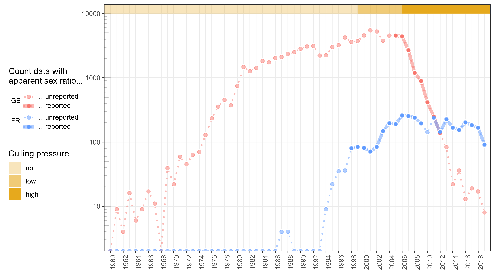
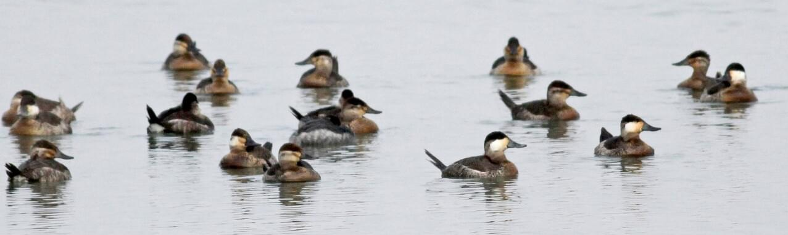
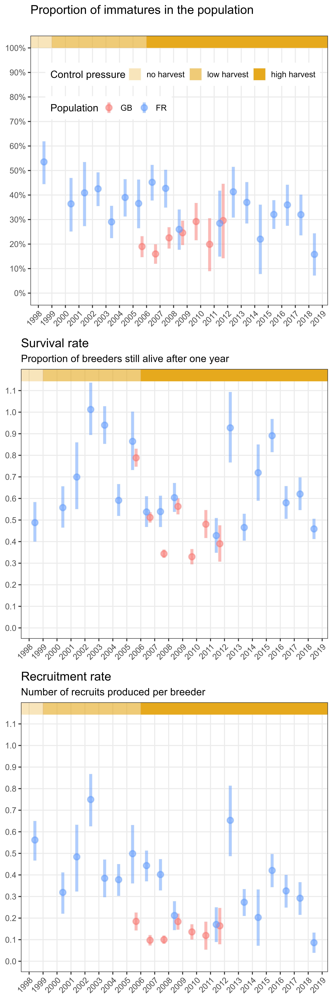
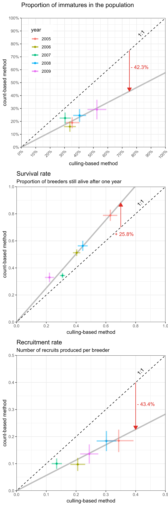
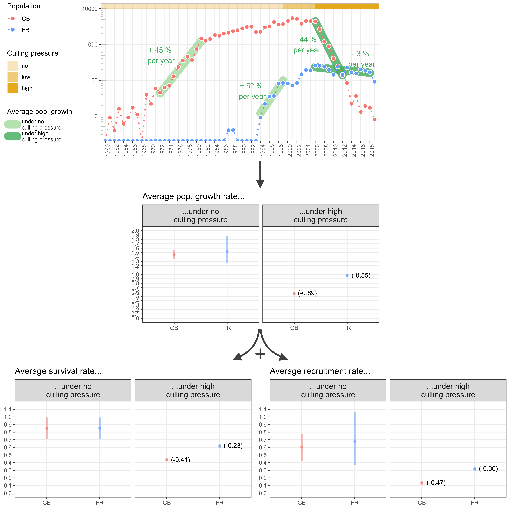
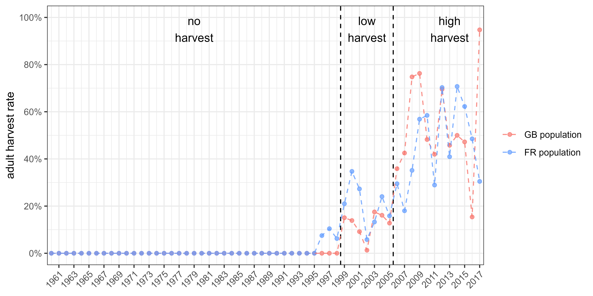

```{r setup, include=FALSE}
knitr::opts_chunk$set(echo = FALSE, 
                      warning = FALSE, 
                      message = FALSE, 
                      out.width = "100%", 
                      fig.align = "center",
                      fig.pos = 'H') # hold position / requires package "float"

Sys.setlocale("LC_ALL", "en_US.UTF-8")

```

\newpage

\linenumbers

# Introduction

Assessing the growth rate of populations is a first step towards a better understanding of the factors underlying the dynamics of natural populations [e.g. @Niel2005]. It is also crucial for measuring the effectiveness of management actions that are taken to recover, control, or eradicate populations [@Shea1998]. Among the approaches available to managers to achieve these goals, those that rely on monitoring the number of individuals (counts) are by far the most popular [@Rintala2022]. In many cases, these methods allow the investigation of environmental factors underlying changes in population size, and thus help in the implementation of mitigating actions [@Faillettaz2019]. Unfortunately, relying solely on the monitoring of population abundance generally hinders the fundamental understanding of the demographic mechanisms underlying changes in population growth rates. More specifically, on the basis of counts alone, it is almost impossible to assess the extent to which population growth rate is affected by changes in adult survival rather than to variations in productivity [@Austin2000], which is defined as the product of all reproductive parameters. To assess the relative sensitivity of population growth rate to factors affecting adult survival or reproductive parameters, demographers usually rely on the monitoring of individuals by capture-mark-recapture [@Lebreton1992]. In practise, however, capture and release of individuals cannot always be relied upon, as the legal status of the species precludes any additional disturbance (e.g. critically endangered species) or prohibits the release of live individuals (e.g. invasive species or pests). Even though capture-mark-recapture methods are efficient for assessing demographic parameters, they have potential drawbacks, such as their invasiveness, which can affect behaviour and thus survival or reproductive success, and their affordability when time and money are scarce. Genetic monitoring is a non-invasive alternative to capture-mark-recapture, but it is costly and requires large samples [@Caniglia2011].

Most of the time, therefore, managers make the best of a bad job by using counts as a viable option for tracking changes in population size and then population growth rate to assess the relevance of management actions. Distinguishing between immatures and adults in counts allows estimation of adult survival rate, i.e. the proportion of breeders that have survived for one year, and productivity/recruitment rate, i.e. the number of immatures produced per breeder that reach sexual maturity, which are, by definition, recruited in the breeding population. This additional effort makes it possible to assess the relative influence of each of these components on the population growth rate. Alternatively, the assessment of age structure in hunting bags has been used to infer the role of decreasing reproductive success in population declines in a number of game species, including ducks and geese, but suffers from intractable biases [@Fox2018]. Of course, the latter approach is not appropriate for protected/endangered species.

Here we exemplify how, in dimorphic species, delayed sexual maturity of males can be used to estimate adult survival and recruitment rates by distinguishing male-like and female-like individuals in repeated winter counts. We used two non-native European populations of Ruddy duck (*Oxyura jamaicensis*) as a study model. Like many other duck species, Ruddy duck is dimorphic: newborn males look like females until the prenuptial moult, which takes place in late winter. As a result of the late prenuptial moult of immatures, the apparent proportion of males increases over the course of the wintering season. These changes in the apparent proportion of males during this period are therefore directly related to the proportion of immatures in the populations and thus to the reproductive success of the previous breeding season. The "apparent sex ratio" method developed in this study was used to estimate adult survival and recruitment rates and evaluate the effects of two different eradication strategies used in Great Britain and France, respectively.

# Materials & methods

The Ruddy duck is a stiff-tailed duck native to the American continent. Starting from seven individuals acclimatised at the Slimbridge Wetland Centre in the 1940s [@GutierrezExposito2020], a feral population began to establish in Great Britain and the first attempts at reproduction in the wild were observed in the 1960s (Figure \@ref(fig:count)). This feral population grew rapidly and spread across the country until it reached more than 5,000 individuals in the early 2000s. In the late 1980s, a feral population also began to establish on the continent, particularly in France, supposedly due to the arrival of British-born individuals. However, in contrast to observations in Great Britain, Ruddy ducks have not spread very much in France. Most observations and breeding attempts have been concentrated in the north-west of the country. In France, almost no Ruddy ducks were observed in winter outside the lake of Grand Lieu (47.09°N, 1.67°W), which greatly facilitated the monitoring of this population. Ruddy ducks are considered a major threat to the endangered native White-headed duck (*Oxyura leucocephala*) in the south-western Mediterranean, as they hybridise and thus pose an increased risk of genetic pollution and genetic assimilation of the latter by the former [@MunozFuentes2007]. To reduce the risk of genetic pollution of the White-headed duck by the Ruddy duck, eradication measures were implemented in both Great Britain and France in the late 1990s [@GutierrezExposito2020], followed by a European Ruddy duck eradication plan in 1999 [@Hughes1999] (Figure \@ref(fig:count)).

The trends and status of the White-headed duck and Ruddy duck populations used to be determined exclusively by counts. It was therefore not possible to assess the factors impairing the recovery of the former and the effectiveness of the eradication programme for the latter. In particular, counts alone cannot be used to assess the relative impact of changes in adult survival and recruitment rates on population growth rates, which is a prerequisite for identifying limiting factors.

```{r count, fig.cap = "(ref:count)"}

```

Like many other duck species, both White-headed duck and Ruddy duck exhibit delayed dichromatism, i.e. young males acquire the colourful plumage typical of their species and can therefore be distinguished from females during the pre-breeding period, typically from mid-winter in the earliest individuals [@Baldassarre2014]. Delayed dichromatism generally explains the discrepancies in estimates of apparent proportions of males counted in winter compared to proportions of males counted in spring or males identified from individuals culled in winter (Figures \@ref(fig:flock) & \@ref(fig:pmal)).

Interestingly, delayed dichromatism allows the estimation of adult survival and recruitment/productivity by observing the seasonal evolution of the apparent sex ratio and making few and reasonable assumptions (see next section).

<!-- Interestingly, delayed dichromatism allows estimating the proportion of immature males, which is the difference between the proportion of female-like individuals between winter and spring. The proportion of all immature individuals is twice this value if we assume an even sex ratio at birth [@Bellrose1961; @Blums1996] and comparable mortality rates between immature females and immature males [@Ramula2018; @Wood2021]. The proportion of immatures can even be estimated only from winter counts by making the assumption of a known and unchanging adult sex ratio over the monitoring period [@Devineau2010], as developed inhere. By combining this proportion of immatures to reliable counts over two successive winters, both adult survival rate and recruitment rate can be estimated. -->

```{r flock, fig.cap = "(ref:flock)"}

```

```{r pmal, fig.cap = "(ref:pmal)"}
knitr::include_graphics("../Output/plot_paper_1_saved.png")
```

We monitored the demography of Ruddy duck populations in both Great Britain (GB) and France (FR) by conducting extensive counts on the wintering grounds between 1 December and 31 January. In addition, the apparent sex ratio could be determined using winter counts that distinguished between female-like and male-like individuals. Such counts were carried out in Great Britain from 2006 to 2012, which corresponded to a period of sharp population decline (Figure \@ref(fig:count)). In France, count surveys taking into account apparent sex were conducted in 1999, 2001-2009, and 2012-2019. The French population grew rapidly in the first years of monitoring and then stabilised from 2006 onwards as a result of high culling pressure. In both countries, culling was carried out under strict official control so that the exact number of individuals culled was known. Although the age ratio of birds culled before 2009 could not be determined with certainty in France, it was still possible to roughly categorise the culling pressure in both countries into three categories: "no culling" before 1999, "low culling" between 1999 and 2005 and "high culling" from 2006 onwards (see Figure \@ref(fig:sup) in Supplementary Material).

## Inferring adult survival and recruitment rates from changes in population size and proportion of immatures

The proportion of immature males is the difference between the proportion of female-like individuals between winter and spring. The proportion of all immature individuals is twice as high if we assume an even sex ratio at birth [@Bellrose1961; @Blums1996] and comparable mortality rates between immature females and immature males [@Ramula2018; @Wood2021]. However, spring counts suffer from intractable problems, such as the different detectability of females and males during this season. Fortunately, the proportion of immatures can also be estimated from winter counts alone, assuming a known and unchanged adult sex ratio along the monitoring period [@Devineau2010].

The adult sex ratio is therefore a prerequisite for estimating the proportion of immatures. This ratio could be derived from culling data as we determined the sex of each adult culled as part of the eradication programmes in both Great Britain and France. Nevertheless, the low number of individuals culled in France prevented from getting robust adult sex ratio. In Great Britain, adult sex ratios did not differ from month to month, so data from culled adults collected throughout the whole biological cycle were pooled together each year. The proportion of males also did not differ statistically between years in which more than 500 adults were culled. This is consistent with previous findings showing that the adult sex ratio in ducks is usually very stable in the short term [@Wood2021] but can fluctuate in the long term. Therefore, we pooled the data from all adults culled in the control programme to estimate the adult sex ratio, see Equation \@ref(eq:pm).

Assuming the additive property of the binomial distribution, the proportion of immatures in a population can be derived from the proportion of males among adults (alternatively the adult sex ratio) and the proportion of male-like individuals in the different counts in winter (assuming that all these individuals are adult males), see Equation \@ref(eq:pic). By combining the population growth rate derived from the interannual variation of an index of abundance with the proportion of immatures, adult survival and recruitment rates can be derived, see Equation \@ref(eq:vr) and Figure \@ref(fig:outline). If the absolute value of the population size is known, the number of adults and the number of recruits can be estimated, see Equation \@ref(eq:VR). We called this approach the "apparent sex ratio" method.

| Variable name         | Description                                                                                                |
|:-|:-------|
| *Observation (input)* |                                                                                                            |
| $AM$                  | Total number of adult males culled as part of the eradication programme                                      |
| $AF$                  | Total number of adult females culled as part of the eradication programme                                    |
| $CML_{i, t}$          | Number of male-like individuals counted in population $i$ in year $t$                                      |
| $C_{i, t}$            | Number of individuals counted in population $i$ in year $t$                                                |
| $N_{i, t}$            | Size of the population $i$ in year $t$ (maximum number of individuals counted in the wintering population) |
| *Parameter (output)*  |                                                                                                            |
| $p(m|a)$              | Proportion of males among adults (or probability of being a male knowing it is an adult)                      |
| $p(a \cap m)_{i, t}$  | Proportion of adult males in population $i$ in year $t$                                                    |
| $p(a)_{i, t}$         | Proportion of adults in population $i$ in year $t$                                                         |
| $p(re)_{i, t}$        | Proportion of immatures/recruits in population $i$ in year $t$                                             |
| $s_{i, t}$            | Adult survival rate, i.e. proportion of individuals in year $t-1$ still alive in year $t$                  |
| $r_{i, t}$            | Recruitment rate, i.e. number of recruits in population $i$ in year $t$ per individual in year $t - 1$     |
| $S_{i, t}$            | Number of adults in population $i$ in year $t$                                                             |
| $R_{i, t}$            | Number of recruits in population $i$ in year $t$                                                           |

```{=tex}
\begin{equation}
p(m|a) \sim {\sf Beta}(AM, AF)
(\#eq:pm)
\end{equation}
```
```{=tex}
\begin{align}
CML_{i, t} & \sim {\sf Binom}(p(a \cap m)_{i, t}, C_{i, t}) \notag \\
& \sim {\sf Binom}(p(m|a).p(a)_{i, t}, C_{i, t}) \notag \\
& \sim {\sf Binom}(p(m|a).(1 - p(re)_{i, t}), C_{i, t})
(\#eq:pic)
\end{align}
```
```{=tex}
\begin{equation}
\begin{aligned}
s_{i, t} & = \frac{N_{i, t}}{N_{i, t - 1}}.(1 - p(re)_{i, t}) \\
r_{i, t} & = \frac{N_{i, t}}{N_{i, t - 1}}.p(re)_{i, t}
\end{aligned}
(\#eq:vr)
\end{equation}
```
```{=tex}
\begin{equation}
\begin{aligned}
S_{i, t} & = N_{i, t}.(1 - p(re)_{i, t}) \\
R_{i, t} & = N_{i, t}.p(re)_{i, t}
\end{aligned}
(\#eq:VR)
\end{equation}
```
```{r outline, fig.cap = "(ref:outline)"}
knitr::include_graphics("../Output/outline.png")
```

## Validating the "apparent sex ratio" method

The relevance of the method was assessed by testing the likelihood of the estimates of both vital rates. For the adult survival rate, we checked whether the values were contained in the interval $[0;1]$, and compared our estimates with those in the literature [e.g. @Buxton2004; @Krementz1997; @Nichols1992, @Nichols1997]. Validation of the recruitment rate was more difficult because if the lower limit is 0, the upper limit is a product of all maximum values of its individual components, i.e. nesting rate, nesting success, clutch-size, hatching success, pre-fledging survival, and fledging survival. These reproductive parameters may be known for some duck species, but the last one is never mentioned [e.g. @Baldassarre2014].  

To overcome this problem, we developed an indirect approach to estimate the maximum expected recruitment rate without exploitation and assuming that the level of population density does not affect the components of the recruitment process. Estimated values above this maximum recruitment rate would reflect a partial detection of adult males. On the other hand, null or negative recruitment rates would indicate that immature males acquired male plumage prior to the survey, or that the assumption about the stability of the adult sex ratio was violated.

In practise, the maximum recruitment rate was estimated from the difference between the maximum growth rate and the maximum survival rate of adults, see Equation \@ref(eq:GR). This relationship resulted from a simple consideration for a closed population: the population size in year $t$ is equal to the number of adults that survived the whole year $t - 1$ plus the offspring produced in year $t - 1$ that survived to the reproductive period of year $t$, i.e. the recruitment in year $t$ [@Flint2015]. In an open population, adult survival and recruitment rates are confounded with adult and recruit migrations, respectively, but this does not change the equation. This relationship becomes more complex when a species with delayed maturity is considered, see @Robertson2008.

| Variable name | Description                                                                                 |
|:-|:---------|
| $N_{t}$       | Number of adults in year $t$                                                                |
| $D_{t}$       | Number of adults dead during year $t$                                                       |
| $R_{t}$       | Number of recruits in year $t$                                                              |
| $s_{t}$       | Adult survival rate, i.e. proportion of individuals in year $t-1$ still alive in year $t$   |
| $r_{t}$       | Recruitment rate, i.e. number of recruits in year $t$ produced per individual in year $t-1$ |
| $\lambda_{t}$ | Growth rate of the population between year $t-1$ and year $t$                               |

```{=tex}
\begin{align} 
N_{t} & = N_{t-1} - D_{t-1} + R_{t} \notag \\
N_{t} & = N_{t-1} - (1 - s_{t}).N_{t-1} + r_{t}.N_{t-1} \notag \\
N_{t} & = s_{t}.N_{t-1} + r_{t}.N_{t-1} \notag \\
\frac{N_{t}}{N_{t-1}} & = s_{t} + r_{t} \notag \\
\lambda_{t} & = s_{t} + r_{t} \notag \\
r_{t} & = \lambda_{t} - s_{t}  
(\#eq:GR)
\end{align}
```
The maximum adult survival rate was defined as a uniform distribution on the interval $[0.7;1]$. The lower limit corresponded to the upper range of survival rates observed in waterfowl species of similar weight, and the upper limit was set to 1, as survival rates of long-lived waterfowl species are very high [@Nichols1997; @Krementz1997; @Buxton2004; @Nichols1992; @Koons2014].

For both populations, the maximum growth rates occurred during their geographic expansion phase, which preceded the start of the eradication programmes (Figure \@ref(fig:count)). To estimate robust maximum population growth rates for both populations, we smoothed the annual growth rates over a consistent time period by using a linear regression on the logarithm scale, see Equation \@ref(eq:L). We discarded the data for Great Britain before 1972 as the estimates were likely noisy when the population was low (below 50 individuals) (Figure \@ref(fig:count)). After reaching the threshold of 1,000 individuals, the population growth in Great Britain (GB) showed a strong inflexion, although culling had not yet started (Figure \@ref(fig:count)). This observation suggests that a negative density-dependent process could occur beyond 1,000 individuals and led us to consider only the first sequence of the time series to infer the maximum growth rate in Great Britain, i.e. 1972-1981. For the French (FR) population, the sequence without culling pressure covered the period 1994-1999.

| Variable name    | Class     | Description                                                                                              |
|:-|:-|:--------|
| $N0_{i, J}$      | Parameter | Intercept of the regression model                                                                        |
| $\lambda_{i, J}$ | Parameter | Average population growth rate over a restricted time interval $J$ for a population $i$ (in $year^{-1}$) |
| $t \in J$        | Index     | Year index within the time interval $J$                                                                  |
| $\sigma_{i, J}$  | Parameter | Standard deviation of the regression model                                                               |

```{=tex}
\begin{equation}
log(N_{i, t}) \sim {\sf Norm}(N0_{i, J} + log(\lambda_{i, J}).t, \sigma_{i, J})
(\#eq:L)
\end{equation}
```
Estimating vital rates within an acceptable range, as defined above, would not prove that our modelling approach correctly reflects the actual interannual variability. To determine this, we compared the proportions of immatures and the vital rates derived from counts with those derived from culling, i.e. from individuals culled as part of the eradication programme. As we restricted the dataset to years with more than 100 individuals culled in winter for sake of precision, the analysis only covered five years of the GB population time series. The proportions of immatures were estimated from the culled individuals by checking the presence of the bursa of Fabricius, which is only present in immature individuals [@Hochbaum1942]; see Equation \@ref(eq:pis). Adult survival and recruitment rates were then derived from the proportion of immatures and the Equation \@ref(eq:vr).

| Variable name | Class        | Description                                                              |
|:-|:-|:--------|
| $SI_{i, t}$   | Observation  | Number of immatures culled in the wintering population $i$ in year $t$   |
| $S_{i, t}$    | Observation  | Number of individuals culled in the wintering population $i$ in year $t$ |

```{=tex}
\begin{equation}
SI_{i, t} \sim {\sf Binom}(p(re)_{i, t}, S_{i, t})
(\#eq:pis)
\end{equation}
```
## Assessing the effects of culling strategies

During the period when culling pressure was high (i.e. from 2006 onwards), eradication strategies in Great Britain and France differed. In Great Britain, most individuals were culled in winter (53.4% of adults were culled before 30 May), whereas in France, most individuals were culled during the breeding season (81.6% of adults were culled after 30 May). We investigated whether these strategies had different effects on the populations by comparing the resulting growth rates and the relative contributions of both vital rates to them (by comparing the average values during the period of high culling pressure with proxies for the maximum vital rates estimated when both populations reached their maximum growth, see previous section). In France, a LIFE project was implemented from 2019 to intensify the culling pressure, especially in winter and spring. We therefore excluded the FR time series from 2019 onwards in order to compare homogeneous culling strategies.

## Statistical framework

We used the Bayesian framework to implement all submodels presented in Materials & methods section. The Bayesian framework is both straightforward and efficient in propagating error through the parameters. We used uninformative priors for all parameters. Since the maximum growth rate is a life history trait expected to be stable between populations of the same species, we used an uninformative hierarchical prior for this parameter. We generated three chains of length 500,000, with a thinning of 10 to avoid autocorrelation in the samples, and discarded the first 2,000 samples as burn-in. We checked the chain convergence using the Gelman and Rubin convergence diagnostic (R\<1.1, @Gelman1992). The models were fitted using NIMBLE [@Valpine2017] run from R [@RCT2022]. The values **X[Y; Z]** reported in Results section are the medians and the corresponding limits of the 95% confidence interval of the posterior distributions. We preferred the median to the mean because it is more robust to skewed distributions.

# Results

## Estimating vital rates

The "apparent sex ratio" method successfully provided estimates and associated uncertainties for the proportion of immatures in both wintering populations. Adult survival and recruitment rates, i.e. the two components that determine the population growth rate, were also correctly estimated (Figure \@ref(fig:vital)).

```{r vital, fig.cap = "(ref:vital)"}

```

The proportion of males among adults, which is a prerequisite for inferring the proportion of immatures, was estimated at 0.60 [0.59; 0.61]. The proportion of immatures ranged between 0.16 [0.07; 0.24] and 0.54 [0.44; 0.62], depending on the population and year. The lowest values were similar in both populations, but the range of the proportion of immatures in the GB population was much smaller (upper value GB: 0.30 [0.14; 0.45] & FR: 0.54 [0.44; 0.62]). The proportion of immatures in the GB population was stable over time, while a slight but significant decrease was observed in the FR population.

Adult survival rates ranged between 0.33 [0.29; 0.37] and 1.01 [0.89; 1.14]. None of the estimates were significantly outside the range of a survival rate defined without immigration [0; 1]. No trend in adult survival rate was observed in either population, but the patterns were different: adult survival in GB was lower and showed less interannual variability than in FR.

Recruitment rates ranged between 0.09 [0.04; 0.13] and 0.75 [0.63; 0.87]. All estimates were above 0, which is not inconsistent with reality. Furthermore, the maximum recruitment rate was 0.68 [0.36; 0.78] (see 3rd Results section), and no estimate was significantly outside the range of recruitment rates defined without immigration [0; 0.78]. No trend was observed for the GB population, but the recruitment rate decreased for the FR population, although it was more noisy than the proportion of immatures. As with the survival rate, the GB population also showed lower recruitment rate values with less variability than the FR population.

Lower values and lower variability of both adult survival and recruitment rates estimated in the GB population than in the FR population probably explain the different trends of the two Ruddy duck populations: a sharp and constant decline in the GB population versus a slow and variable decline in the FR population (Figure \@ref(fig:count)). In the FR population, the range of recruitment rates (min/max difference: 0.66) was larger than the range of survival rates (min/max difference: 0.58). Conversely, the range of survival rates (min/max difference: 0.46) in the GB population was much larger than the range of recruitment rates (min/max difference: 0.08). This suggests that the variability in population growth rate in FR was mainly determined by recruitment, whereas in GB it was mainly determined by changes in adult survival.

## Testing the reliability of the estimates

In Great Britain, the proportions of immatures derived from the counts were positively correlated with those derived from the culled individuals (Figure \@ref(fig:cor)). This result therefore supports the hypothesis that the proportion of female-like individuals in the overwintering populations is efficient for the assessment of age structure and thus productivity. The correlation was even stronger when looking at vital rates (Figure \@ref(fig:cor)), but this was to be expected because the two methods for estimating these vital rates had a common component, namely the population growth rate (see Equation \@ref(eq:vr)). Interestingly, a 1:1 correlation was not achieved for any of the parameters. The proportion of immatures derived from the counts is always lower than the proportion derived from the culled individuals. The discrepancy between these two estimates is due to the fact that immatures are probably more vulnerable to culling than adults and may therefore be over-represented in the culling samples. As a result, the correlation coefficients for both vital rates also differed. However, the differences between the two approaches do not call into question the ability of the "apparent sex ratio" method to capture interannual variability of the vital rates.

```{r cor, fig.cap = "(ref:cor)"}

```

## Assessing the demographic response to culling strategies

When there was no culling pressure, maximum growth rates were very similar for the two populations (Figure \@ref(fig:mgr)), namely 1.45 [1.36; 1.55] and 1.52 [1.25; 1.88] for GB and FR, respectively. These values corresponded to an increase in the population of 45% and 52% per year, respectively. Assuming a maximum adult survival rate of 0.85 [0.7; 1] for both populations, we derived maximum recruitment rates of 0.60 [0.42; 0.78] and 0.68 [0.36; 1.06] for GB and FR, respectively.

Despite the low number of sex- and age-determined culled individuals, the proxies of culling pressure showed significant changes over time (Figure \@ref(fig:sup)). Therefore, we categorised culling pressure according to this intensity. High culling pressure occurred from 2006 onwards in both populations (although the signal was noisy). However, despite the similar level of culling pressure, the culling strategies of the two populations differed considerably, see 3rd Materials & Methods section. Under high culling pressure, the growth rate decreased to 0.56 [0.53; 0.59] and 0.97 [0.94; 1.00] for GB and FR, corresponding to a decrease of 44% per year and 3% per year, respectively. This result shows that the GB population declined significantly during the high culling pressure, while the FR population was just stabilised.

Adult survival rates under high culling pressure reached 0.44 [0.42; 0.46] and 0.62 [0.59; 0.64] for GB and FR, respectively, and the recruitment rates decreased to 0.13 [0.11; 0.15] and 0.32 [0.29; 0.34], respectively. The resulting decrease in the growth rate of the GB population corresponded to a similar average decrease in adult survival rate (-0.41) and recruitment rate (-0.47), whereas the stabilisation of the FR population was due to a decrease in recruitment rate (-0.36) rather than a decrease in adult survival (-0.23). Overall, the culling strategy used in GB was more effective than that used in FR as it affected both adult survival and recruitment rates.

```{r mgr, fig.cap = "(ref:mgr)"}

```

# Discussion

Disentangling the contribution of vital rates to population growth rate is a key step towards better understanding a population's response to management actions [@Williams2002]. We exploited delayed sexual dichromatism to develop a new approach based on counts to disentangle the growth rate of a population into its two major structural components: adult survival and recruitment rates. The development of the "apparent sex ratio" method is based on a unique data set of two comparable populations of the same species, the Ruddy duck. Both populations were monitored in a similar way from their introduction to a period of intense culling pressure, but the culling strategies differed markedly. The very similar demographic trajectories and properties of both populations under similar ecological conditions made it possible to assess the response to both culling pressure and culling strategies.

## Monitoring adult survival and recruitment rates

For both populations, vital rate estimates were within the same range, showing some consistency in the results obtained using the "apparent sex ratio" method. The greater variability observed for the FR population was to be expected as the time series covered a wider range of culling pressure than that of the GB population. We found no temporal correlation of demographic parameters between the two populations, suggesting that regional (e.g. weather) rather than large-scale factors (e.g. climate) were predominant. This is consistent with previous findings showing, for example, that in waterfowl both breeding success and juvenile survival depend on the onset of the laying period, which is closely linked to local weather (e.g. spring temperature, cumulative rainfall, water levels) [@Folliot2017; @Blums2004; @Dzus1998] and local changes in predation pressure [@Jaatinen2022].

The counts used to implement our model took place in mid-winter, at a time when some immature males may be initiating their moult. This could partially violate the assumption that the male-like individuals were exclusively adult males, and thus potentially bias our estimates. Nevertheless, as the survival estimates are in the range of those reported for similar species [@Nichols1997; @Krementz1997; @Buxton2004; @Buderman2023], this assumption appears to be reliable. Therefore, the time window for the count surveys must be carefully chosen to take into account the time before the immature males start moulting.

In some years, the estimated adult survival values were outside the range of expected values, although never significantly above 1. One possible explanation for these discrepancies is a violation of the "closed population" assumption. Although the ringing data suggest that Ruddy ducks do not undertake long-distance seasonal migrations in GB (Henderson, pers. comm.), the possibility that immigration occurred cannot be completely ruled out. The outliers in  survival and recruitment rates observed in FR in 2002 and 2012 suggest that there was significant immigration in those years.

The theoretical maximum population growth rate is an inherent trait related to the demographic characteristics of a species [@Dmitriew2010; @Niel2005]. This trait is expected to be similar in all Ruddy duck populations around the world. In our study, we observed that the maximum growth rates of the two populations were very close to each other, which was to be expected as both populations were exposed to similar ecological conditions, i.e. no harvest and similar breeding conditions. In addition, before the eradication programmes started, the two populations had population growth rates much closer to the expected maximum values than any other native duck species in the same areas during the same period. Prior to the eradication programmes, the survival rates of both populations were in the upper range of those observed for other diving duck species (e.g. \~ 0.8 for the Common pochard [@Folliot2020; @Nichols1997]). Predation on diving duck nests was found to decrease during the breeding season in a French fishpond complex [@Bourdais2015]. As Ruddy ducks generally breed later than Common pochards and Tufted ducks, both a higher survival rate and greater nesting success could be responsible for the high growth rates of Ruddy duck populations in the absence of culling. The "apparent sex ratio" method not only provided estimates of adult survival and recruitment rates that were consistent with observed increasing population sizes, but also provided estimates that were consistent with both declining phases following the implementation of eradication programmes and observed differences in population growth rates under different culling strategies. As expected, higher values for survival and recruitment rates were observed when the culling strategy focussed on the post-breeding season rather than the pre-breeding season.

Assuming that culling data provide a good picture of interannual variability in age structure [@Fox2014], the strong correlation between estimates derived from counts and estimates derived from culled individuals demonstrates the ability of the "apparent sex ratio" method presented here to properly capture interannual variation in demographic parameters such as survival and recruitment rates. The fact that the observed correlation was strong despite being based on a short time series strengthens its robustness. In addition, the strength of the relationship between the parameters obtained with the two approaches also indicates that important assumptions of our model were met, such as the constant adult sex ratio. The temporal autocorrelation of the adult sex ratio could be explained by the fact that it includes many age cohorts, which makes it structurally strong. In the long term, there may be substantial fluctuations in the adult sex ratio, but our results suggest that it is not necessary to monitor and update it annually. The proportion of males among adults estimated in the present study (i.e., 0.60) is within the range of values observed in native Ruddy duck populations of North America (0.62 in @Bellrose1980) and in other duck species [@Wood2021]. The "apparent sex ratio" method consistently yielded recruitment rates that were almost a factor of two lower than the method based on culling data, a result consistent with higher vulnerability of immatures to shooting [@Fox2014]. In North America, for example, immature waterfowl were found to be 1.3 to 2.6 times more vulnerable to hunting than adults [@Bellrose1980].

As no estimates of adult survival were available in the literature [see @Buderman2023], we were unable to properly assess the accuracy of the "apparent sex ratio" method for estimating this parameter. Nevertheless, there is evidence that the method is not highly biassed, as described above. Thus, the "apparent sex ratio" method would be much more efficient for monitoring key demographic parameters than alternative methods such as those based on culling/hunting bag data, which have been shown to be unreliable [@Fox2014], even when focussing on the end of the hunting season to limit potential bias [@Fox2016].

## Evaluating eradication strategies

Both populations responded to culling pressure with a significant decline in their growth rate, meaning that the increased mortality from culling was not compensated for by an increase in natural survival or improved breeding success. Culling was therefore effective in affecting the demographic trajectory of Ruddy duck in both cases. However, the decline in population growth was much greater in GB, where the population declined steadily and sharply, than in FR, where the increase was halted and the population size remained more or less stable. The greater decline in population growth observed in GB compared to FR, was due to a greater decline in adult survival and recruitment rates. Overall, adult survival and recruitment rates appeared to be significantly affected by culling in both countries. However, culling pressure targeting future breeders (pre-breeding culling strategy applied in GB), appeared to be much more effective in reducing both survival and recruitment rates than culling pressure targeting breeders and newly born individuals during the breeding and rearing season (breeding culling strategy applied in FR).

As expected, the pre-breeding culling strategy had the same effect on adult survival and recruitment rates, as a bird killed before the breeding season reduces the breeding population (lower adult survival rate) and prevents the bird from reproducing (lower recruitment rate). When using the breeding culling strategy, the recruitment rate was more affected than the adult survival rate. This was probably due to the fact that immatures are much more susceptible to being shot than adults [@Bellrose1980; @Fox2014]. The compensation hypothesis states that the increased mortality of immatures due to harvesting may be compensated for by a higher natural survival [@Cooch2014], but this hypothesis is not supported by the observations. Overall, there was no evidence of a compensatory mechanism in either context. This could be due to the fact that both populations were far from reaching carrying capacity, meaning that competition for resources was relaxed [@Peron2013].

With more or less comparable culling pressure, the pre-breeding culling strategy proved to be much more effective. However, this does not mean that the breeding culling strategy was not also effective. On the contrary, it proved to be quite efficient in stopping both the population increase and the expansion of the distribution area, and in triggering a significant population decline in a second attempt by slightly increasing the culling pressure. So if winter culling is not possible, which was the case in FR, culling during the breeding season is effective in stopping or reversing the increase in populations of this species. However, the breeding culling strategy is compromised by the highly variable detectability of immatures, as these individuals colonise new ponds. This leads to fluctuations in the recruitment rate and thus jeopardises the long term efficiency of this strategy. This problem does not exist with the pre-breeding strategy, as the Ruddy ducks congregate at a limited number of sites in winter [@Johnsgard1996].

The response of the two Ruddy duck populations to culling pressure shows that it is necessary to take the culling period into account in order to make correct predictions of population trajectory. Predicting the effects of harvest pressure on a waterfowl population is then not only a question of the level of harvest, but also the timing of the harvest [@Kokko1998]. Unexpectedly, our results suggest that harvesting waterfowl during the breeding season has far less impact on population growth rate than harvesting in winter. Consequently, a target for effective management of harvested waterfowl could be an earlier start and end of the hunting season.

## Implications for waterfowl management 

An important implication of our study concerns the timing of harvest to limit its impact on populations growth rates. Unexpectedly, our results show that the persistence of waterfowl populations should benefit from earlier openings and closings of the hunting season (see above).

Tracking fluctuations of population abundance is a common tool for determining the conservation status of a population [e.g. @Folliot2022]. But tracking abundance alone does not provide enough information to assess the underlying mechanisms behind changes in population growth [@Williams2002]. This requires “digging deeper” [@Austin2000], for example, by monitoring individuals to assess parameters such as survival and recruitment rates [e.g. @Arnold2018]. However, monitoring individuals is time-consuming [e.g. @Souchay2016] and not always possible for endangered species. The "apparent sex ratio" method makes it possible to circumvent these disadvantages in dichromatic species with delayed sexual maturity of the males. These species include the White headed duck in southern Spain, which is highly endangered and cannot be disturbed through capture-mark-recapture. Thus, by improving census strategies and disaggregating the effects of variations in adult survival and productivity on population growth using the approach presented here, much more invaluable information on the relevance of management strategies could be obtained. 

<!-- The immature proportion, alternatively the age ratio, is commonly used to describe the renewal capacity of a waterfowl population and to track the changes of its productivity [@Smith2001; @Bellrose1980; @Robertson2008; @Rodway2015; @Zimmerman2010]. The recruitment rate however remains a better indicator than the immature proportion/age ratio, the latter only having the advantage of being more directly accessible. Indeed, the immature proportion/age ratio does not account for the dynamics of the population and reflects the population productivity only if the population growth is steady. For instance, let us consider a breeding population of 100 individuals reaching 100 individuals the next year, which then drops to 60 individuals the second year. If there are 50% immatures each year, corresponding to a 1:1 age ratio, we may be tempted to conclude that the productivity is stable over time. But it actually corresponds to a strong decrease of the productivity (-40%) because the recruitment rate evolved from 0.5 recruits per breeder the first year to 0.3 recruits per breeder the second year. This demonstrates that the immature proportion/age ratio suffers from caveats that can be misleading for a manager. According to @Blums2004, recruitment in diving ducks is not related to fecundity, but depends mostly on juvenile survival, the other component of the recruitment that is mostly driven by weather conditions. Studies on other birds also conclude of the poor correlation between fecundity and recruitment [e.g. @Murray2000]. Fecundity alone does not provide all knowledge that is required for a manager to understand the dynamics of a population. -->

Finally, we would like to emphasise that the main aim of our approach was to decompose population growth into its two main components, and not to provide unbiased estimates of adult survival or recruitment rates. However, if necessary, count surveys could be designed to do so, at least in theory, and for species that exhibit observable delayed dichromatism. This trait affects most species of stiff-tailed duck [@Johnsgard1996], as well as numerous other duck species, including Tufted duck, *Aythya fuligula*, Black scotter, *Melanitta nigra americana*, Common Goldeneye, *Bucephala clangula americana* [@Johnsgard1978; @Bellrose1980]. Modifying standard monitoring protocols to distinguish between male-like and female-like individuals is almost costless, but worth the effort as it would greatly increase the efficiency of conservation/management actions [@Nichols2006].

# Acknowledgments {.unnumbered}

This work was partly funded by the LIFE Oxyura project (LIFE17 NAT/FR/000942) under the LIFE programme. We warmly thank Jay McGowan for his permission to publish his photograph of Ruddy duck. This work was carried out at the suggestion of Jean-François Maillard and Jean-Baptiste Mouronval of the *Office Français de la Biodiversité*, and Jean-Marc Gillier of the *Société Nationale pour la Protection de la Nature*. The authors acknowledge all the contributors of the data collection: in Great Britain, Wildfowl & Wetlands Trust staff past and present, in particular Baz Hughes, Peter Cranswick and Colette Hall, and all the project workers at the Animal and Plant Health Agency and its predecessors & in France, Office Français de la Biodiversité staff past and present, especially Vincent Fontaine, Denis Lacourpaille, Agathe Pirog, Hugo Pichard, Justin Potier, Alexis Laroche, Médéric Lortion, Jules Joly, and Valentin Boniface, as well as the whole team of the Société Nationale pour la Protection de la Nature of the Grand Lieu lake.

\nolinenumbers

# References {.unnumbered}

::: {#refs}
:::

\newpage

# (APPENDIX) sup {.unnumbered}

# Supplementary Materials

```{r sup, fig.cap = "(ref:sup)"}

```

(ref:count) Temporal changes in the number of Ruddy ducks (logarithmic scale) in Great Britain (GB) and France (FR) from 1960 to 2019, with references to periods when apparent sex ratios were reported

(ref:flock) A flock of Ruddy ducks observed in winter, including ten female-like individuals with whitish striped cheek (some of which are immature males), four male-like individuals with white cheek and black cap (all adult males), three unidentified individuals (1^st^, 4^th^, and 10^th^ from left) © Jay McGowan - 3 February 2013 - Tompkins, New York, United States

(ref:pmal) Proportions of males estimated by internal examination of individuals culled in a same year under the eradication programmes (Male % in cullings), and proportions of individuals showing male-like plumage counted in winter (Male % in counts); discrepancies between the two estimates are due to delayed dichromatism (immature males looking like females before moulting); we used these discrepancies to estimate survival and productivity/recruitment

(ref:outline) Overview of the "apparent sex ratio" method used to disentangle the population growth into survival (adult survival rate) and productivity (recruitment rate)

(ref:vital) Temporal changes in the proportions of immatures and vital rates following culling pressure in the populations of Great Britain (GB) and France (FR); the vertical bars represent the 95% confidence intervals

(ref:cor) Relationship between parameter estimates obtained from counts ("apparent sex ratio" method) and those obtained from culled individuals (culling-based method); only five years were available for the GB population; the bars represent 95% confidence intervals and the red arrow indicates the direction and average differences between the two methods

(ref:mgr) Average effects of culling pressure and different culling strategies (GB versus FR) on population growth rates (derived from counts only), and on adult survival and recruitment rates (derived from counts and reports of apparent sex ratios); the culling pressure for the GB population occurred mainly during the pre-breeding season, while for the FR population it was mainly concentrated during and after the breeding season (see \@ref(HARV) for details); adult survival and recruitment rates under high culling pressure were averaged over a period in which consistent culling pressure was observed; the vertical bars show 95% confidence intervals

(ref:sup) Definition of three periods with different culling pressure using an index based on an estimate of the adult culling rate; as only half of the culled individuals in France were age-determined before 2009, we applied the average age ratio over 2009-2019 to the remaining individuals in order to obtain an estimate of the number of adults in the culling data before 2009; the culling rate increased over time, so we divided the time series into three categories: we defined a "no culling" period before 1999 as the culling rate for both countries was mostly zero and always below 10%, we defined a "low culling" period between 1999 and 2005 as the culling rate for both countries fluctuated around 20%, the culling rate then increased significantly for both countries, therefore we defined a "high culling" period from 2006 onwards
