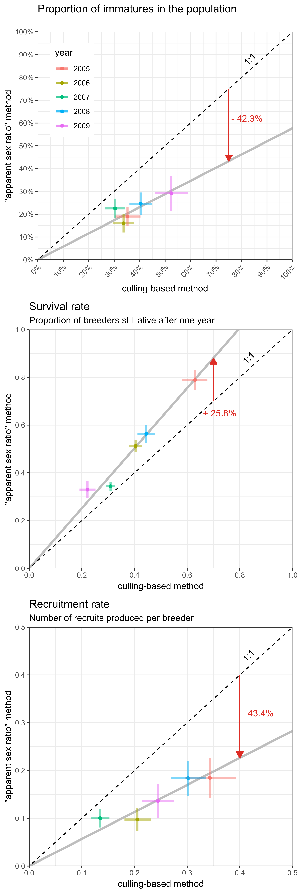
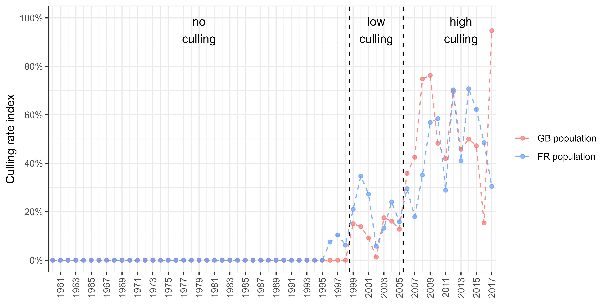

```{r setup, include=FALSE}
knitr::opts_chunk$set(echo = FALSE, 
                      warning = FALSE, 
                      message = FALSE, 
                      out.width = "100%", 
                      fig.align = "center",
                      fig.pos = 'H') # hold position / requires package "float"

Sys.setlocale("LC_ALL", "en_US.UTF-8")

```

\newpage

\linenumbers

# Introduction

Assessing population growth rate is a key step towards a better understanding of factors underlying the dynamics of natural populations [e.g. @Niel2005]. It is also crucial for measuring the efficacy of management actions potentially undertaken to help population recovery, control, or eradication [@Shea1998]. Among the approaches available to managers for reaching these goals, those relying on the monitoring of the number of individuals are by far the most popular [@Rintala2022]. In many instances, these methods even enable environmental factors underlying changes in population size to be investigated, and hence some mitigating actions to be implemented [@Faillettaz2019]. Unfortunately, relying on the monitoring of numbers of individuals alone generally hinders basic understanding of the demographic mechanisms underlying changes in population growth rates. More specifically, based on counts only, it is nearly impossible to assess the extent to which population growth rate is affected by change in survival rather than to variations in reproductive parameters [@Austin2000]. To assess the relative sensitivity of population growth rate to factors affecting survival or reproductive parameters, demographers most often rely on the monitoring of individuals by capture-mark-recapture [@Lebreton1992]. In practice, however, one cannot always rely on the capture and release of individuals owing to the legal status of the species that precludes any additional disturbance, e.g. critically endangered species, or forbid the release of alive individuals, e.g. invasive species or pests. Furthermore, capture and handling may also be so stressful to individuals that their behaviour and/or the very parameters under study may be altered. Indeed, although highly efficient for assessing demographic parameters, capture-mark-recapture methods have potential drawbacks such as being invasive and hardly affordable when time and money are limiting. Genetic monitoring is a non-invasive alternative to capture-mark-recapture approaches based on physical captures, but it suffers from being costly and time-consuming, and requires quite rigorous sampling schemes in the field [@Caniglia2011]. 

Most of the time therefore, managers do the best of a bad job using counts as the only viable option for tracking population growth rates and assessing the efficiency of management actions. Counting the number of immatures produced in addition to live adults may enable adult survival and recruitment rate to be estimated, and hence provides knowledge on which of these components has the most influence on population growth rate. The recruitment rate, defined as the average number of immatures per breeder reaching the sexual maturity, is the product of two main sub-parameters: the fecundity followed by the juvenile survival [@Arnold2018; @Etterson2011]. The recruitment rate is sometimes also called annual fertility [e.g. @Koons2014], reproductive rate [e.g. @Cooch2014], reproductive success [e.g. @Etterson2011], or productivity [e.g. @Hagen2008; @Johnson1987]. Unfortunately, assessing the respective contribution of the adult survival and the recruitment rate is only possible for a limited number of species in which broodless adults and those with young display the same detectability. Alternatively, assessing the sex and age structure in hunting bags has been used to infer the role of decreasing reproductive success in population declines in a number of game species including ducks [e.g. @Fox2018]. However, this approach is not suited for protected/endangered species with no harvest. Here we exemplify how, in dimorphic species, delayed maturity of males can be exploited for estimating adult survival and recruitment rate by differentiating male-like to female-like individuals in repeated winter counts. We used two non-native Ruddy duck, *Oxyura jamaicensis*, populations introduced in Europe as a study model. As numerous duck species, the Ruddy duck is dimorphic, with newly born males looking like females until the pre-nuptial moult, which occurs in late winter. This means that the apparent proportion of males increases over the course of the wintering season. These changes in apparent proportions of males during this period are therefore directly related to the proportion of immatures into the populations and hence to reproductive success and recruitment rate of the previous spring/summer. This study details the method to infer adult survival and recruitment rate from count data, and an application is developed to assess the impact of two different eradication strategies deployed in Great Britain and in France, respectively. 

# Materials & methods {#MM}

The Ruddy duck is a stiff-tailed duck native from the Americas. From seven individuals initially acclimated in the Slimbridge Wetland Centre in Great Britain in the 40’s [@GutierrezExposito2020], a feral population began to establish with the first observed reproductive attempts in the wild in the 60s (Figure \@ref(fig:count)). This feral population rapidly grew and spread to the entire country to reach more than 5,000 individuals in the early 2000s. By the end of the 80s, a feral population began to establish also on the continent in France, supposedly owing to the arrival of individuals born in Great Britain. Contrary to what was observed in Great Britain, the French Ruddy duck population did not spread much, with the vast majority of observations and breeding attempts clustering in Western France. In France, during winter, almost no Ruddy duck is observed outside the lake of Grand Lieu (47.09°N, 1.67°W), which is thus the exclusive wintering site and greatly facilitates the monitoring of this population. The feral European populations of Ruddy duck are considered as a major threat to the endangered native White-headed duck, *Oxyura leucocephala*, population of the South-Western Mediterranean, because of hybridization risks and thus an elevated potential for genetic pollution and eventually genetic assimilation of the latter by the former [@MunozFuentes2007]. In order to mitigate the risks of genetic pollution of the White-headed duck by Ruddy ducks, eradication measures were taken both in Great Britain and in France from the late 90s [@GutierrezExposito2020], (Figure \@ref(fig:count)), and a European Ruddy duck eradication plan has been initiated by the European Commission in 1999 [@Hughes1999]. The release of non-native species in the wild, including Ruddy ducks, is forbidden in countries of the European Union, and the status of White-headed duck populations is highly unfavourable. The use of capture-mark-recapture to monitor populations of these species is thus impossible. As a result, the effectiveness of the eradication of Ruddy ducks and management actions intended to favour the recovery of White-headed ducks were essentially assessed through censuses. Censuses, however, prevented assessment of the relative effects or changes in survival and recruitment rates on population growth rate, which is a key towards a proper understanding of the efficiency of management actions. 

```{r count, fig.cap = "(ref:count)"}
knitr::include_graphics("../Output/plot_paper_2_mod.png")
```

Like many other ducks, Ruddy ducks and White-headed ducks both display delayed dichromatism. Thereby, immature males are confounded to immature and adult females until a first moult occurring in mid-winter for the early ones [@Baldassarre2014], but most likely latter for most of them. Immature males acquire then the typical colourful breeding plumage of their kind in spring [@Baldassarre2014]. Delayed dichromatism explains why the apparent proportion of females in winter counts is always greater than the true proportion of females that can be assessed in counts of late winter or in removals (Figures \@ref(fig:flock) & \@ref(fig:pfem)). Thus, it is possible to assess the proportion of immatures within a population by monitoring the seasonal evolution of apparent sex ratio and assuming an even sex ratio at birth [@Bellrose1961; @Blums1996], comparable mortality rates between females and males among juveniles [@Ramula2018; @Wood2021], and unchanging adult sex ratio over the monitoring period [@Devineau2010]. Then, both adult survival rate and recruitment rate can be estimated by combining the age ratio thus obtained with reliable counts over two successive winters.

```{r flock, fig.cap = "(ref:flock)"}
knitr::include_graphics("../Output/flock.png")
```

```{r pfem, fig.cap = "(ref:pfem)"}
knitr::include_graphics("../Output/plot_paper_1_saved.png")
```

We monitored the demography of Ruddy duck populations in both Great Britain and France using exhaustive counts on the wintering grounds during the period between December 1 and January 31. In addition, counts that distinguished female-like from male-like individuals were performed from 2006 to 2012 in Great Britain, which corresponded to a period of strong decline of the population (Figure \@ref(fig:count)). In France, the monitoring spread over 1999, 2001-2009, and 2012-2019. This population grew rapidly during the first years of the monitoring and then stabilized from 2006 onwards, which corresponds to a period with a high culling effort, which was performed under control of the authorities in both countries. Even if the age ratio in the removals was uncertain before 2009 in France, it is possible to grossly qualify the culling pressure in three categories for both countries: "no culling" before 1999, "low culling" between 1999 and 2005, and "high culling" from 2006 (see Figure \@ref(fig:sup) in Supplementary Materials). 

## Vital rates inference from count data

In waterfowl, survival rate is commonly higher in adult males than in adult females [@Baldassarre2014]. Adult sex ratio is then generally biased towards males (Figure \@ref(fig:pfem), @Szekely2014). As a consequence, deducing the proportion of immatures within a population from the observed proportion of adult males is not straightforward because the proportion of adults is not just twice as much as the observed proportion of adult males. There were no counts differentiating male-like from female-like individuals during the breeding period to properly estimate adult sex ratio. But sex identification in adults from removals was available for both Ruddy duck populations. However, the small population size in France prevented from getting precise adult sex ratios. A comparison over months in Great Britain showed no difference in proportion of males in adults, so data from adults collected over the whole year were used to estimate the proportion of males in adults. A comparison of proportion of males in adults among years with more than 500 samples did not exhibit significant interannual differences. Even if the adult sex ratio may vary over a long time range, it is relatively stable over a few years [@Wood2021]. As a consequence, removal data from all adults were pooled to estimate the proportion of males in adults, see Equation \@ref(eq:pm). 

Assuming the additive property of the binomial distribution, the proportion of immatures can be deduced from the cumulated counts of male-like individuals in the wintering population, see Equation \@ref(eq:pic). From this proportion and the interannual variation of an abundance index of population size, adult survival and recruitment rate are straightforward, see Equation \@ref(eq:vr). If the absolute value of population size is accessible, numbers of adults and recruits can be estimated, see Equation \@ref(eq:VR).

|Name|Class|Description|
|:---|:----|:----------------------------|
|$AM$|Data|Total number of adult males in removals|
|$AF$|Data|Total number of adult females in removals|
|$p(m|a)$|Parameter|Proportion of males in adults (or probability of being a male knowing it is an adult)|
|$CML_{i, t}$|Data|Cumulated number of male-like individuals counted in population $i$ in year $t$, which are assumed to all be adult males|
|$C_{i, t}$|Data|Cumulated number of individuals counted in population $i$ in year $t$|
|$p(a \cap m)_{i, t}$|Parameter|Proportion of adult males in population $i$ in year $t$|
|$p(a)_{i, t}$|Parameter|Proportion of adults in population $i$ in year $t$|
|$p(i)_{i, t}$|Parameter|Proportion of immatures in population $i$ in year $t$|
|$N_{i, t}$|Data|Size of the population $i$ in year $t$ (maximum number of individuals counted in the wintering population)|
|$s_{i, t}$|Parameter|Adult survival rate, i.e. proportion of individuals in year $t-1$ still alive in year $t$|
|$r_{i, t}$|Parameter|Recruitment rate, i.e. number of recruits in population $i$ in year $t$ per individual in year $t - 1$|
|$S_{i, t}$|Parameter|Number of adults in population $i$ in year $t$|
|$R_{i, t}$|Parameter|Number of recruits in population $i$ in year $t$|

\begin{equation}
p(m|a) \sim {\sf Beta}(AM, AF)
(\#eq:pm)
\end{equation}

\begin{align}
CML_{i, t} & \sim {\sf Binom}(p(a \cap m)_{i, t}, C_{i, t}) \notag \\
& \sim {\sf Binom}(p(m|a).p(a)_{i, t}, C_{i, t}) \notag \\
& \sim {\sf Binom}(p(m|a).(1 - p(i)_{i, t}), C_{i, t})
(\#eq:pic)
\end{align}

\begin{equation}
\begin{aligned}
s_{i, t} & = \frac{N_{i, t}}{N_{i, t - 1}}.(1 - p(i)_{i, t}) \\
r_{i, t} & = \frac{N_{i, t}}{N_{i, t - 1}}.p(i)_{i, t}
\end{aligned}
(\#eq:vr)
\end{equation}

\begin{equation}
\begin{aligned}
S_{i, t} & = N_{i, t}.(1 - p(i)_{i, t}) \\
R_{i, t} & = N_{i, t}.p(i)_{i, t}
\end{aligned}
(\#eq:VR)
\end{equation}

## Validation of the count-based method {#VAL}

The relevance of the method was assessed by testing the likelihood of the estimates of both vital rates. For adult survival rate, we checked if the values belonged to the expected interval $[0;1]$, and we compared the values to literature data on ducks that are accessible because adult survival is commonly assessed by capture-mark-recapture [@Lebreton2001]. Maximum adult survival is defined as a uniform distribution on $[0.7;1]$. The lower limit corresponds to the upper range of survival rates in literature for waterfowl species of similar weight, the upper limit was set to 1 because survival rates of long-life waterfowl species are very high [@Nichols1997; @Krementz1997; @Buxton2004; @Nichols1992]. Recruitment rate is more tricky to validate because it is not upper bounded as it is defined on $[0;\infty[$ and is neither explicitly informed in literature. Only some components of the recruitment rate are generally described, such as nesting rate, nesting success, clutch size, hatching success, early stage survival, but rarely survival between the juvenile stage and the first breeding season, which is necessary to inform recruitment rate [e.g. @Baldassarre2014]. We then developed an approach to estimate the maximum expected recruitment rate without exploitation and without negative density-dependence processes, and we checked if all values were equal or below this maximum recruitment rate. If the recruitment rate outputs of the model are significantly higher than maximum recruitment rate, it means that the method overestimates such rate, which reflects that a part of adult males are not detected during count surveys. A null or negative recruitment rate would mean that immature males moulted before the survey or/and the assumption on the stability of the adult sex ratio is overrated. 

Practically, maximum recruitment rate is deduced by using its relationship to maximum growth rate and maximum adult survival rate, see Equation \@ref(eq:GR). This relationship comes from a simple reasoning for a closed population: population size in year $t$ is equal to the number of adults that survived over year $t - 1$ plus the offspring produced in year $t - 1$ that survived until the reproduction period of year $t$, i.e. the recruitment in year $t$. The growth rate of a population is thus the sum of adult survival rate plus recruitment rate [@Flint2015]. For an open population, adult survival and recruitment rates are confounded to adult and recruit migrations, respectively. This relationship becomes more complex if a species with delayed maturity is considered, see @Robertson2008. 

|Name|Description|
|:--|:----------------------------|
|$N_{t}$|Number of adults in year $t$|
|$D_{t}$|Number of adults dead during year $t$|
|$R_{t}$|Number of recruits in year $t$|
|$s_{t}$|Adult survival rate, i.e. proportion of individuals in year $t-1$ still alive in year $t$|
|$r_{t}$|Recruitment rate, i.e. number of recruits in year $t$ produced per individual in year $t-1$|
|$\lambda_{t}$|Growth rate of the population between year $t-1$ and year $t$|

\begin{align} 
N_{t} & = N_{t-1} - D_{t-1} + R_{t} \notag \\
N_{t} & = N_{t-1} - (1 - s_{t}).N_{t-1} + r_{t}.N_{t-1} \notag \\
N_{t} & = s_{t}.N_{t-1} + r_{t}.N_{t-1} \notag \\
\frac{N_{t}}{N_{t-1}} & = s_{t} + r_{t} \notag \\
\lambda_{t} & = s_{t} + r_{t} \notag \\
r_{t} & = \lambda_{t} - s_{t}  
(\#eq:GR)
\end{align}

The maximum growth rate occurred for both populations during their expansion phase, when change in population size was the steepest. To estimate robust maximum population growth rates for both populations, we smoothed annual population growth rate over a consistent time period by using a linear regression on the logarithm scale, see Equation \@ref(eq:L). To do so, we discarded Great Britain data before 1972 since the size estimate of this population was noisy below 50 individuals (Figure \@ref(fig:count)). After reaching the threshold of 1,000 individuals, the Great Britain (GB) population growth showed a strong inflexion whereas no culling pressure was applied. This observation suggests that a negative density-dependence process might occur beyond 1,000 individuals and led to consider only the first sequence of the time series to infer on the maximum growth rate in Great Britain, i.e. 1972-1981. For the French (FR) population, the sequence without culling effort spread over the period 1994-1999. 

|Name|Class|Description|
|:--|:----|:----------------------------|
|$N0_{i, J}$|Parameter|Intercept of the regression model|
|$\lambda_{i, J}$|Parameter|Average population growth rate over a restricted time interval $J$ for a population $i$ (in $year^{-1}$)|
|$t \in J$|Index|Year index within the time interval $J$| 
|$\sigma_{i, J}$|Parameter|Standard deviation of the regression model|

\begin{equation}
log(N_{i, t}) \sim {\sf Norm}(N0_{i, J} + log(\lambda_{i, J}).t, \sigma_{i, J})
(\#eq:L)
\end{equation}

Even if both vital rates vary in a likely range following the validation methodology previously described, this does not prove that the interannual variability is properly tracked. In order to validate this aspect, we compared the outputs of the count-based method, i.e. the proportion of immatures and both vital rates, to outputs based on data from removals. Only data from years with more than 100 individuals culled in winter were selected. It covers 5 years of the count time series of the GB population. The presence of the bursa of Fabricius enables immature to be identified with certainty [@Hochbaum1942]. The estimation of the proportion of immatures in removals is then straightforward, see Equation \@ref(eq:pis). Adult survival and recruitment rates were then estimated by combining this proportion and Equation \@ref(eq:vr). We discussed the ability of the count-based method to accurately track the interannual variability by comparing the outputs of the two methods. 

|Name|Class|Description|
|:---|:----|:----------------------------|
|$SI_{i, t}$|Data|Number of immatures sampled in the wintering population $i$ in year $t$|
|$S_{i, t}$|Data|Number of individuals sampled in the wintering population $i$ in year $t$|

\begin{equation}
SI_{i, t} \sim {\sf Binom}(p(i)_{i, t}, S_{i, t})
(\#eq:pis)
\end{equation}

## Impact of culling strategies on vital rates {#HARV}

Over the high culling period, i.e. from 2006 onwards, strategies differed between Great Britain to France. In Great Britain, culling mostly occurred in winter, i.e. before the breeding period (53.4% of adults were shot before the 30^th^ May), whereas it was mostly done in summer in France, i.e. during and after the breeding period (81.6% of adults were shot after the 30^th^ May). We compared the population growth of the two populations in light of the difference between the two strategies and we assessed the respective response of the vital rates by comparing the average values over the high culling period to proxies of maximum vital rates estimated when both populations reached their maximum growth (see Section \@ref(VAL)). In France, a LIFE project was implemented from early 2019 to intensify the culling pressure, especially during winter and spring. We therefore excluded the FR time series from 2019 in order to provide a comparison of homogeneous culling strategies.

For all the sub-models in Section \@ref(MM), the Bayesian framework was used for its efficiency and simplicity to propagate error through the parameters. We used uninformative priors on all parameters. As the maximum growth rate is a life history trait expected to be stable among populations of a given species, we used an uninformative hierarchical prior for this parameter. We generated three chains of length 500,000, with a thinning of 10 to avoid autocorrelation in the samples, and we discarded the first 2,000 samples as burn-in. Chain convergence was assessed using the Gelman and Rubin convergence diagnostic (R<1.1, @Gelman1992). We fit the models using NIMBLE [@Valpine2017] run from R [@RCT2022]. Data and code are available here: https://github.com/adri-tab/Ruddy_duck_vital_rates. The values **X[Y; Z]** reported in Section \@ref(RES) are the medians and the associated boundaries of the 95% confidence interval of posterior distributions. The median was preferred to the mean because of its robustness to skewed distribution.

# Results {#RES}

## Estimates of vital rates

The method successfully provided estimates and associated uncertainty of immature proportion in both wintering populations. Adult survival rate and recruitment rate, i.e. the two components of the population growth rate, were also estimated by the method successfully (Figure \@ref(fig:vital)). 
 
```{r vital, fig.cap = "(ref:vital)"}
knitr::include_graphics("../Output/plot_paper_3.png")
```

The proportion of males in adults, which is a prerequisite to infer the proportion of immatures, was estimated at 0.60 [0.59; 0.61]. The immature proportion ranged from 0.16 [0.07; 0.24] to 0.54 [0.44; 0.62]. The lower values were similar for the two populations, but the range of the proportions of immatures in the GB population was far more limited (upper value : 0.30 [0.14; 0.45]). As opposed to the FR population, there were no significant differences from a year to another because all estimates overlapped with each other. The proportion of immatures was relatively stable over time in the GB populations, while a slight decrease was observed for the FR population.

Adult survival rate ranged from 0.33 [0.29; 0.37] to 1.01 [0.89; 1.14]. No estimates were significantly outside the range of a survival rates defined without immigration [0; 1]. No trend in adult survival rate was recorded in any of the two populations, although two main differences could be observed. The GB population had the lowest values of adult survival rate, and even if there were significant difference among years for both populations, the variability for the GB population was slightly lower.

Recruitment rate ranges from 0.09 [0.04; 0.13] to 0.75 [0.63; 0.87]. All estimates were above 0, meaning there was no senseless estimation. The maximum recruitment rate being 0.68 [0.36; 0.78] (see Section \@ref(MAX)), no estimates were significantly outside the range of recruitment rates defined without immigration [0; 0.78]. Similarly to the immature proportion, no trend was observed for the GB population, but recruitment rate decreased for the FR population even if it was more noisy than for the immature proportion. As for survival rate, the GB population had low values of recruitment rate, and even if significant differences were observed among years for both populations, the variability for the GB population was far lower than for the FR population.

The lower variability of both vital rates for the GB population explained its steady population growth over the considered time series compared to the FR one (Figure \@ref(fig:count)). In the FR population, the range of recruitment rates (min/max difference: 0.66) was higher than the range of survival rates (min/max difference: 0.58). Conversely, the range of survival rates (min/max difference: 0.46) in the GB population was far higher than the range of recruitment rate (min/max difference: 0.08). This reflected that the variability of the population growth rate for the FR population was mostly driven by recruitment rate whereas the main source of variability was the adult survival for the GB population.

## Likelihood of year-to-year variability in vital rates

From the five years available in the GB population, proportions of immatures that were estimated from the count-based method were positively correlated to estimates from removal data (Figure \@ref(fig:cor)). The hypothesis that the proportion of female-like individuals in the wintering populations reflected the age structure of these populations was then supported by this result. This correlation was even stronger when considering vital rates (Figure \@ref(fig:cor)). This stronger correlation was expected since the two methods estimating these vital rates had a component in common, the growth rate of the population (see Equation \@ref(eq:vr)). 

It was noticeable that a 1:1 correlation was never obtained. Proportion of immatures was lower in counts than in removals. This result was not surprising because immature individuals were expected to be more vulnerable to culling than adults and might then be over represented in removal data. As a consequence, the correlation coefficients for both vital rates also differed from 1. This difference between the two approaches did not question the previous validation of the ability of the count method to track the interannual variability of the vital rates. 

```{r cor, fig.cap = "(ref:cor)"}

```

## Response of vital rates to culling strategies {#MAX}

Under no culling pressure, maximum growth rates were very similar for the two populations (Figure \@ref(fig:mgr)), respectively 1.45 [1.36; 1.55] and 1.52 [1.25; 1.88] for the GB and the FR population. It corresponded to an increase of 45% per year and 52% per year, respectively. Based on literature, we assumed a maximum survival rate similar for both populations 0.85 [0.7; 1]. We deduced a maximum recruitment rate of 0.60 [0.42; 0.78] for the GB population and of 0.68 [0.36; 1.06] for the FR population.  

Even if a significant part of culled individuals were not aged for some years, the proxies of the culling pressure exhibit significant shifts over time (Figure \@ref(fig:sup)). This led to consider a high culling pressure period from 2006 onwards with no clear difference between the two populations because the signal was very noisy. Even if the culling pressure seemed comparable, the culling strategies differed significantly between the two populations, see Section \@ref(HARV). Under high culling pressure, the growth rate dropped to 0.56 [0.53; 0.59] and 0.97 [0.94; 1.00] for the GB and the FR population, respectively, which corresponded to a decrease of 44% per year and 3% per year. This result showed that the GB population significantly decreased during the high culling pressure whereas the FR population was stabilized. 

Adult survival rate under high culling pressure was 0.44 [0.42; 0.46] and 0.62 [0.59; 0.64] for the GB and FR populations, respectively, when the recruitment rate decreases to 0.13 [0.11; 0.15] and 0.32 [0.29; 0.34], respectively. The drop in growth rate of the GB population corresponded to a similar average drop in adult survival rate (-0.41) and in recruitment rate (-0.47). The stabilisation of the FR population was caused by a decrease of recruitment rate (-0.36) more than a drop in adult survival (-0.23). Overall, vital rates of the GB population were more affected than the FR population.

```{r mgr, fig.cap = "(ref:mgr)"}
knitr::include_graphics("../Output/plot_paper_5_mod.png")
```

# Discussion

The delayed sexual dichromatism in a waterfowl species was used here to develop and test the validity of a new non-invasive method aiming to break down the apparent growth of a population into its two structural components: adult survival rate and recruitment rate. Disentangling the contribution of these two vital rates is a key to understand the response of a population to management measures and potentially adapt these accordingly [@Williams2002]. The development of the method held on a unique dataset of two comparable populations of the same species, the Ruddy duck. Both populations were tracked from their introduction in a similar environment to a period of intense culling pressure. This common history trajectory enabled to evaluate the maximum growth rate of this species, but also its response to culling pressure. As the culling strategy differed between the two populations, we detailed the similarities and the discrepancies of the responses of vital rates, and opened the discussion to the generalization of this estimation method and its implications for waterfowl management.

## Accuracy of the method to estimate vital rates

The vital rate estimates of the two populations belonged to the same range, which demonstrates a certain consistency in the results obtained from the method. The greater variability observed in France is not unexpected because the FR time series covered a larger spectrum of culling pressure than the GB time series. There was no temporal correlation between the two populations, suggesting that fluctuations of the vital rates were more likely influenced by regional factors than large-scale ones. This is consistent with literature because both nesting/hatching success and juvenile survival in waterfowl species are conditional to the onset of laying, which is tightly related to local weather parameters, e.g. spring temperature, cumulative rainfall, and water levels [@Folliot2017; @Blums2004; @Dzus1998].

Count surveys used to test the method occurred in mid-winter, when the first immature males were suspected to moult and start to look like adult males. This might partially corrupt the assumption that male-like individuals corresponded only to adult males. Even though no data on adult survival rate were directly available [@Baldassarre2014], the values estimated from the method developed inhere correspond to what is observed in literature for species of similar weight [@Nichols1997; @Krementz1997; @Buxton2004]. Then, the results reflect that there was no major scaling issue using count data from mid-winter for European Ruddy duck populations. In any case, the time window of the count surveys must be chosen with care, i.e. just before the moult of immature males, to limit the bias of the outputs. On a few years, the values of adult survival rate were outside the range of expected values even if they were never significantly over 1. A likely reason to these extreme values is a corruption of the closed population assumption during some years. Indeed, if there is an arrival from another Ruddy duck population, the true recruitment cannot explain by itself the population growth and leads to an adult survival combining true adult survival and adult immigration. For the FR population, upper outliers of recruitment rates and survival rates were observed in 2002 and 2012, suggesting immigration events during these years.

The theoretical maximum of the population growth rate is a potential which is determined by intrinsic life history traits of a species [@Dmitriew2010; @Niel2005]. This potential is expected to be similar to all Ruddy duck populations anywhere in the world. Realised maximum growth rates that were observed in this study were very close for the two populations. This suggests that the Ruddy duck species reached its intrinsic biological reproduction limit, at least given the environmental conditions of the western Palearctic, i.e. about 0.6 recruits per breeder. The consistency of this intermediate result suggests that the population size estimation was quite accurate for both populations and demonstrates that their changes were well tracked even with relatively few individuals. The average recruitment rates estimated from the count-based method, with and without culling pressure, were never higher to the proxies of maximum recruitment rate for both populations. The assumption on the accuracy of the count-based method is then again not excluded considering the consistency of this result.

Assuming that removal data provided a good picture of the year-to-year variability of age structure of a population, that is, any bias of shooting towards a given age or sex category is relatively stable over time, the strong correlation with the outputs of our method demonstrates its ability to track interannual fluctuations. This result is robust because such correlation was obvious despite being based on a short time series. This strong relationship was also satisfying because it demonstrates that the assumption of a constant adult sex ratio is not corrupted. The temporal autocorrelation of the adult sex ratio might be explained by the fact that it integrates many age-cohorts, which makes it structurally strong. Even if significant variations of the adult sex ratio can still occur over long time periods, this result demonstrates that it is not necessary to monitor and update it on a yearly basis. The adult sex ratio found here on a restricted time period is in line with the Ruddy duck in its native area [0.62 in @Bellrose1980] and with other duck species [@Wood2021]. The count-based method always provided recruitment rates significantly lower than the method based on removal data by a factor close to two, a result that is in line with the hypothesis that the shooting is generally selective towards immature individuals in waterfowl because they are more vulnerable to hunters than adults [@Bellrose1980; @Fox2014]. The gap of vulnerability among ages observed here is realistic because the culling-induced mortality on first-year immatures compared to adults is higher by a factor ranging from 1.3 to 2.6 for hunted duck species in North America [@Bellrose1980]. 

Overall, even if the true values of vital rates are not known to properly test the accuracy of the count-based method, a beam of arguments supports that the method is not heavily biased. This consists in a big difference with methods based on removal/hunting bag data as demonstrated in @Fox2014, even when one considers an age structure picture that is limited to the end of the hunting season to limit the bias [@Fox2016].

## Population response to management measures

Both populations responded to culling pressure by a large drop of their growth rate, meaning that the compensation of the population to culling mortality was limited if not null. The eradication effort as implemented here was therefore efficient to impact this species. The response of the GB population differed from the FR one because it showed a strong decrease when the FR population got stabilized. The analysis of the growth rate alone did not provide clues to understand the mechanisms explaining the difference of the responses between the two populations. Indeed, the bigger drop of growth rate of the GB population might be explained either by a decrease of adult survival or reproduction success, or both components. 

The vital rates that were estimated thanks to the count-based method supported that the eradication pressure affected negatively both adult survival and recruitment rates in the two populations on average. The culling pressure occurring mostly before the breeding period for the GB population targeted by definition future breeders, and consequently induced mortality on these individuals and prevented them from reproducing. We observed that adult survival and recruitment rates decreased equally, which is a result in line with the expectation of this culling strategy. For the FR population, the culling pressure mostly occurred during the postbreeding period. This strategy should induce a higher mortality on immatures as they are expected to be more vulnerable to hunting [@Bellrose1980; @Fox2014]. However, this anthropogenic mortality on immatures might be compensated by a higher survival of the future recruits because competition for resources is decreased [@Cooch2014]. Recruitment rate of the FR population being more affected by 50% than adult survival, the results support the hypothesis that no or only a limited compensation occurred. This conclusion is even strengthened by the result on the GB population. Indeed, we should expect a decrease of recruitment rate lower than adult survival rate if immatures would take advantage of additional resources getting unexploited by culled adult individuals. The equal decrease of the two vital rates supports that there is no such compensation. This might be explained by the fact that the population size was far lower than the carrying capacity of the available habitats, so there was no competition for resources that potentially enhanced the survival of the remaining immature individuals [@Peron2013]. 

If we were in a situation where shooting mortality was fully compensatory to natural mortality, the FR strategy would be counter-productive. However, since the studied Ruddy duck populations are expanding, it seemed that the postbreeding culling strategy still provided some results to control such populations. However, the analysis of the year-to-year variability of recruitment rate demonstrates that the prebreeding strategy strongly buffered the recruitment and maintained it to a low level every single year, whereas recruitment rate of the postbreeding strategy was highly variable. This might be because culling future breeders ensured to avoid the production of potential recruits whereas the postbreeding culling strategy could not prevent and dampen exceptional reproduction events. The postbreeding strategy is also affected by the highly variable detectability of immatures, as these individuals spread over many reproduction habitats with variable accessibility to observers/shooters, whereas the prebreeding strategy targeted individuals that were more easily localized because they usually gathered in open water on a limited number of wintering spots [@Johnsgard1996]. 

The response of the two Ruddy duck populations to culling pressure demonstrates the necessity to account for the culling season to produce proper predictions. Predicting the impact of a harvest pressure on a waterfowl population is then not only a question about how big is the harvest effort, but also mostly when this effort occurs within a year [@Kokko1998]. More generally, disentangling role of adult survival from that of recruitment rate brings capital information to understand the process of harvest on population dynamics and brings key knowledge to improve the conservation of hunted species or the control of invasive species. 

## Implication for waterfowl management

Tracking variations in abundance is a common tool to determine the conservation status of a population [e.g @Folliot2022]. However, abundance alone does not provide information on the mechanisms behind the changes of population growth [@Williams2002]. Identifying the determinants requires to dig into the components structuring population growth to provide relevant tools to managers [e.g. @Austin2000]. Gaining knowledge on adult survival and recruitment rates often involves capture mark recapture surveys [e.g. @Arnold2018]. However, tracking fine time-scale variability of the vital rates requires to mark a minimum number of individuals [e.g. @Souchay2016] and prevents from implementing such method to small populations with a poor conservation status for instance. The method introduced here bypasses these caveats to provide annual estimates of vital rates.

The immature proportion, or age ratio, is commonly used to describe the renewal capacity of a waterfowl population and to track the changes of its productivity [@Smith2001; @Bellrose1980; @Robertson2008; @Rodway2015; @Zimmerman2010]. The recruitment rate however remains a better indicator than the immature proportion/age ratio, the latter only having the advantage of being more directly accessible. Indeed, the immature proportion/age ratio does not account for the dynamics of the population and reflects the population productivity only if the population growth is steady. For instance, let us consider a breeding population of 100 individuals reaching 100 individuals the next year, which then drops to 60 individuals the second year. If there are 50% immatures each year, corresponding to a 1:1 age ratio, we may be tempted to conclude that the productivity is stable over time. But it actually corresponds to a strong decrease of the productivity (-40%) because the recruitment rate evolved from 0.5 recruits per breeder the first year to 0.3 recruits per breeder the second year. This demonstrates that the immature proportion/age ratio suffers from caveats that can be misleading for a manager. According to @Blums2004, recruitment in diving ducks is not related to fecundity, but depends mostly on juvenile survival, the other component of the recruitment that is mostly driven by weather conditions. Studies on other birds also conclude of the poor correlation between fecundity and recruitment [e.g. @Murray2000]. Fecundity alone does not provide all knowledge that is required for a manager to understand the dynamics of a population. 

Applying the method implemented in this study to any other waterfowl species implies that the adult males can be distinguished from the other individuals at a distance. The latter in the season the dichromatism is observable, the better it is to ensure a relevant picture of the age structure of the population and then good estimates of adult survival and recruitment rates. This pattern occurs in most of stifftail duck species [@Johnsgard1996], and in many other duck species, among with Tufted duck, *Aythya fuligula*, Black scotter, *Melanitta nigra americana*, Common Goldeneye, *Bucephala clangula americana* [@Johnsgard1978; @Bellrose1980]. Modifying standard monitoring protocols to distinguish male-like from female-like individuals is almost costless but would provide substantial increases in the efficiency and usefulness of monitoring results in conservation [@Nichols2006].

# Acknowledgments {-}

This work was partly funded by the LIFE Oxyura project (LIFE17 NAT/FR/000942) through the LIFE program. This work was carried on with the impulse of Jean-François Maillard, and Jean-Baptiste Mouronval from the *Office Français de la Biodiversité*, and Jean-Marc Gillier from the *Société Nationale pour la Protection de la Nature*. The authors acknowledge all the contributors of the data collection; in Great Britain, Wildfowl & Wetlands Trust staff past and present, particularly Baz Hughes, Peter Cranswick and Colette Hall, and all the project workers at the Animal and Plant Health Agency and its predecessors; in France, Office Français de la Biodiversité staff past and present, especially Vincent Fontaine, Denis Lacourpaille, Justin Potier, Alexis Laroche, Médéric Lortion, Jules Joly, and Valentin Boniface, and the whole team of the Société Nationale pour la Protection de la Nature of the Grand Lieu lake.

\nolinenumbers

# References {-}

<div id="refs"></div>

\newpage

# (APPENDIX) sup {-}

# Supplementary Materials

```{r sup, fig.cap = "(ref:sup)"}

```


(ref:count) Changes in the size of the two Ruddy duck populations; y-axis is on a log-scale; sex ratio refers to censuses that distinguished female-like from male-like individuals

(ref:flock) Typical observation of a Ruddy duck flock during winter: ten female-like individuals with a whitish striped cheek, four male-like individuals with a white cheek and a black cap, three unidentified individuals (1^st^, 4^th^, and 10^th^ from left) © Jay McGowan - 3 February 2013 - Tompkins, New York, United States

(ref:pfem) Proportion of females in removals vs in counts; For the first category, one data point corresponds to the proportion of females estimated from direct sex identification of the Ruddy ducks culled over one year in a population; for the second category, one data point corresponds to the proportion of individuals wearing female-like plumage in a population counted in winter; the difference of proportion of females between the two approaches is due to immature males that look like females before moulting; this difference is at the root of the method introduced inhere to disentangle adult survival from recruitment

(ref:vital) Changes in the proportion of immatures and the vital rates in light of the culling pressure for both populations; bars define the 95% confidence intervals

(ref:cor) Comparison of the parameter estimates between the count-based method and removal-based method; only five years for the GB population were available; bars define the 95% confidence intervals; the red arrow indicates the average difference between the two methods

(ref:mgr) Comparison between average population growth rate under no pressure vs under high culling pressure; the culling effort for the GB population moslty occurred during the prebreeding period, whereas it mostly focused during and after the breeding period for the FR population (see \@ref(HARV) for details); the average vital rates during the time period of maximum growth were proxies deduced from literature and estimates of maximum population growth (see \@ref(VAL) for details); the vital rates under high culling pressure were average values over a time period observing a consistent culling pressure; bars define the 95% confidence intervals

(ref:sup) Definition of three periods of different culling pressures from an index based on an estimation of adult culling rate; as only half of the culled individuals were aged in France before 2009, we applied the average age ratio over 2009-2019 on unaged individuals to provide an estimate of the number of adults in removals before 2009; culling rate increased over time, we therefore split the time series in three categories : we defined a "no culling" period before 1999 because the culling rate for both countries was mostly null and always below 10%, we defined a "low culling" between 1999 and 2005 because the culling rate varied around 20% for both countries, the culling rate then raised significantly for both countries, so we defined a "high culling" period from 2006 onwards