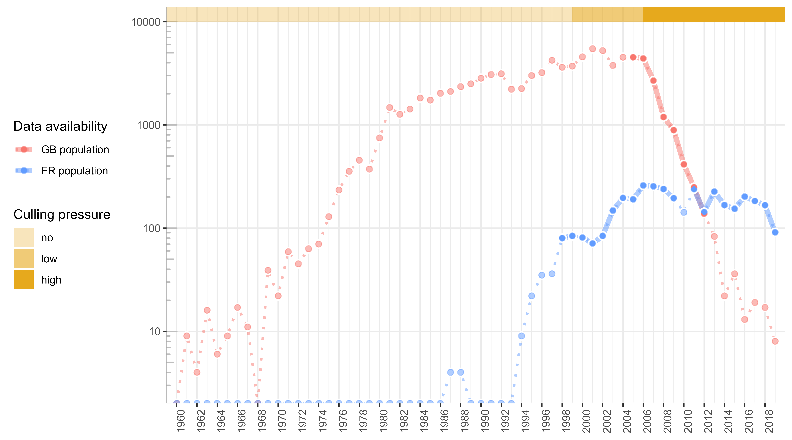
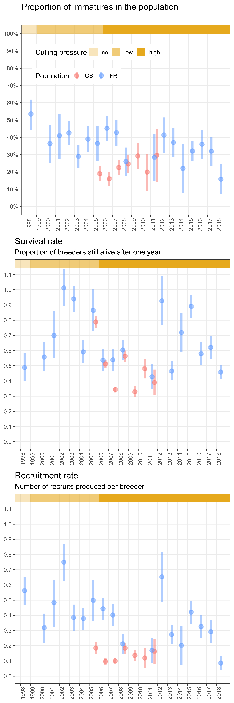

```{r setup, include=FALSE}
knitr::opts_chunk$set(echo = FALSE, 
                      warning = FALSE, 
                      message = FALSE, 
                      out.width = "100%", 
                      fig.align = "center",
                      fig.pos = 'H') # hold position / requires package "float"

Sys.setlocale("LC_ALL", "en_US.UTF-8")

```

\newpage

\linenumbers

# Introduction

Assessing population growth-rate is a key step towards a better understanding of factors underlying the dynamics of natural populations [e.g. @Niel2005]. It is also crucial for measuring the efficacy of management actions eventually undertaken to help population recovery, control, or eradication [@Shea1998]. Among the approaches available to managers for reaching these goals, those relying on the monitoring of the number of individuals are by far the most popular [@Rintala2022]. In many instances, these methods even enable environmental factors underlying changes in population size to be investigated and hence some mitigating actions to be implemented [@Faillettaz2019]. Unfortunately, relying on the monitoring of numbers of individuals alone hinder basic understanding of the demographic mechanisms underlying changes in population growth rates. More specifically, based on counts only, it is nearly impossible to assess to what extent population growth rate is affected by change in survival rather than to variations in reproductive parameters [@Austin2000]. To assess the relative sensitivity of population growth rate to factors affecting survival or reproductive parameters, demographers most often rely on the monitoring of individuals by capture-mark-recapture [@Lebreton1992]. In practice however, one cannot always rely on the capture and release of individuals owing to the legal status of the species that precludes any additional disturbance, e.g. critically endangered species, or forbid the release of alive individuals, e.g. invasive species or pests. Indeed, although highly efficient for assessing demographic parameters, capture-mark-recapture methods have potential drawbacks such as being invasive and hardly affordable when time and money are limiting. Genetic monitoring is a non-invasive alternative to capture-mark-recapture approaches based on physical captures, but it suffers from being costly and time-consuming and requires quite rigorous sampling schemes in the field. 

Most of the time therefore, managers do the best of a bad job using counts as the only viable option for tracking population growth rates and assessing the efficiency of management actions. Counting the number of immatures produced in addition to alive adults may enable adult survival and recruitment rate to be estimated, and hence provides knowledge on which of adult survival and productivity has the most influence on population growth rate. Unfortunately, this is only possible for a limited number of species in which broodless adults and those with young display the same detectability. Alternatively, assessing the sex and age structure in hunting bags has been used to infer the role of decreasing reproductive success in population declines in a number of games species including ducks and geese [@Fox2018]. However, this approach is not suited for protected/endangered species. Here we exemplify how, in dimorphic species, delayed maturity of males can be exploited for estimating productivity/recruitment and adult survival by differentiating male-like to female-like individuals in repeated winter counts. We use two non-native Ruddy duck populations introduced in Europe as a study model. As numerous duck species, the Ruddy duck is dimorphic, with newly born males looking like females until the pre-nuptial moult, which occurs in late winter. This means that the apparent proportion of males increases over the course of the wintering season. These changes in apparent proportions of males during this period are therefore directly related to the proportion of immatures into the populations and hence to the reproductive success and the recruitment rate. This study details the method to infer adult survival and recruitment rate from count data and an application is developed to assess the impact of two different eradication strategies deployed in Great Britain and in France respectively. 

# Materials & methods {#MM}

The Ruddy duck is a stiff-tailed duck native from the Americas. From seven individuals initially acclimated in the Slimbridge Wetland Centre in the Great Britain in the 40’s [@GutierrezExposito2020], a feral population began to establish with the first observed reproductive attempts in the wild in the 60s (Figure \@ref(fig:count)). This feral population rapidly grew and spread to the entire country to reach more than 5000 individuals in the early 2000s. By the end of the 80s, a feral population began to establish also on the continent in France, supposedly owing to the arrival of individuals born in Great Britain. Contrary to what was observed in Great Britain, the French Ruddy duck population did not spread much, with the vast majority of observations and breeding attempts clustering in Western France. In France, during winter, almost none Ruddy duck is observed outside the lake of Grand Lieu (47.09°N, 1.67°W), which is thus the exclusive wintering site and greatly facilitates the monitoring of this population. The feral European populations of Ruddy duck are considered as a major threat to the endangered native White-headed duck population of the South-Western Mediterranean because of hybridization risks and thus an elevated potential for genetic pollution and eventually genetic assimilation of the latter by the former [@MunozFuentes2007]. In order to mitigate the risks of genetic pollution of the White-headed duck by Ruddy ducks, a European plan of eradication of Ruddy ducks has been adopted by the European Commission. As a result, eradication measures were taken both in Great Britain and in France from the late 90s [@GutierrezExposito2020], (Figure \@ref(fig:count)). The release of non-native species in the wild, including Ruddy ducks, is forbidden in countries of the European Union, and the status of White-headed duck populations is highly unfavourable. The use of capture-mark-recapture to monitor populations of these species is thus impossible. As a result, the effectiveness of the eradication of Ruddy ducks and management actions intended to favour the recovery of White-headed ducks were essentially checked through censuses. Censuses, however, prevented from assessing the relative effects or variations in survival and reproductive success/recruitment on population growth rate, which is a key towards a proper understanding of the efficiency of management actions. 

```{r count, fig.cap = "(ref:count)"}

```

Like many other ducks, Ruddy ducks and White-headed ducks both display delayed dichromatism. Thereby immature males acquire the typical colourful plumage of their kind over the course of the interbreeding season, which is typically in late winter. Immature males are thus confounded to immature and adult females before their moult (Figure \@ref(fig:flock)). The delayed dichromatism explains why the apparent proportion of females in the winter counts is always higher than the true proportion of females that can be assessed in winter hunting bags (Figure \@ref(fig:pfem)). Thus, it is possible to assess the proportion of immatures within a population by monitoring the seasonal evolution of apparent sex ratio and assuming an even sex ratio at birth, comparable mortality rates between females and males among juveniles, and unchanging adult sex ratio over the monitoring period. Then, both adult survival rate and recruitment rate can be estimated by combining the age ratio thus obtained with reliable counts over two successive winters.

```{r flock, fig.cap = "(ref:flock)"}
knitr::include_graphics("../Output/flock.png")
```

```{r pfem, fig.cap = "(ref:pfem)"}
knitr::include_graphics("../Output/plot_paper_1.png")
```

We monitored the demography of Ruddy duck populations in both Great-Britain and France thanks to exhaustive counts on the wintering grounds during the period between December 1 and January 31. In addition to these exhaustive counts, censuses that distinguished female-like from male-like individuals (Figure \@ref(fig:count)) were performed from 2006 to 2012 in Great Britain, which corresponded to a strong decline of the population. In France, the monitoring spread over 1999, 2001-2009, and 2012-2019. This population grew rapidly during the first years of the monitoring and then stabilized from 2006, which corresponds to a period with a strong control effort. During these years, the eradication effort, under control of the authorities in both countries, was recorded. Even if the age ratio in the hunting bag was unknown before 2006 in France, we can qualify the harvest pressure on adults in three categories for both countries: "no harvest" before 1999, "low harvest" between 1999 and 2005, and "high harvest" from 2006 (see Figure \@ref(fig:sup) in Supplementary Materials). 

## Vital rates inference from count data

In waterfowl, the survival is commonly higher in adult males than in adult females. Adult sex ratio is then generally biased towards males (Figure \@ref(fig:pfem), @Wood2021). As a consequence, deducing the immature proportion within a population from the observed proportion of adult males is not straightforward because the adult proportion is not just twice as much as the observed proportion of adult males. There were no counts differentiating male-like from female-like during the breeding period to estimate properly adult sex ratio. But sex identification in adults from hunting bags was available for both Ruddy duck populations. However, the small population size in France prevented from getting precise adult sex ratios. A comparison over months in UK showed no difference in adult male proportion, so data from adults collected over the whole year were used to estimate the male proportion. A comparison of male proportion among years with more than 500 samples did not show significant interannual differences. Even if the adult sex ratio may vary over a long time range, it is relatively stable over a few years [@Wood2021]. As a consequence, hunting bag data from all adults were pooled to estimate the male proportion in adults, see Equation \@ref(eq:pm). 

Assuming the additive property of the binomial distribution, the proportion of immatures can be deduced from the cumulated counts of male-like individuals in the wintering population, see Equation \@ref(eq:pic). From this proportion and the interannual variation of an abundance index of the population size, the adult survival and the recruitment rate are straightforward, see Equation \@ref(eq:vr). If the absolute value of the population size is accessible, numbers of adults and recruits can be estimated, see Equation \@ref(eq:VR).

|Name|Class|Description|
|:---|:----|:----------------------------|
|$AM$|Data|Total number of adult males in hunting bags|
|$AF$|Data|Total number of adult females in hunting bags|
|$p(m|a)$|Parameter|Proportion of males in adults (or probability to be a male knowing it is an adult)|
|$CML_{i, t}$|Data|Cumulated number of male-like individuals counted in population $i$ in year $t$, which are assumed to be adult males|
|$C_{i, t}$|Data|Cumulated number of individuals counted in population $i$ in year $t$|
|$p(a \cap m)_{i, t}$|Parameter|Proportion of adult males in population $i$ in year $t$|
|$p(a)_{i, t}$|Parameter|Proportion of adults in population $i$ in year $t$|
|$p(i)_{i, t}$|Parameter|Proportion of immatures in population $i$ in year $t$|
|$N_{i, t}$|Data|Size of the population $i$ in year $t$ (maximum number of individuals counted in the wintering population)|
|$s_{i, t}$|Parameter|Adult survival rate, i.e. proportion of individuals in year $t-1$ still alive in year $t$|
|$r_{i, t}$|Parameter|Recruitment rate, i.e. number of recruits in population $i$ in year $t$ per individual in year $t - 1$|
|$S_{i, t}$|Parameter|Number of adults in population $i$ in year $t$|
|$R_{i, t}$|Parameter|Number of recruits in population $i$ in year $t$|

\begin{equation}
p(m|a) \sim {\sf Beta}(AM, AF)
(\#eq:pm)
\end{equation}

\begin{align}
CML_{i, t} & \sim {\sf Binom}(p(a \cap m)_{i, t}, C_{i, t}) \notag \\
& \sim {\sf Binom}(p(m|a).p(a)_{i, t}, C_{i, t}) \notag \\
& \sim {\sf Binom}(p(m|a).(1 - p(i)_{i, t}), C_{i, t})
(\#eq:pic)
\end{align}

\begin{equation}
\begin{aligned}
s_{i, t} & = \frac{N_{i, t}}{N_{i, t - 1}}.(1 - p(i)_{i, t}) \\
r_{i, t} & = \frac{N_{i, t}}{N_{i, t - 1}}.p(i)_{i, t}
\end{aligned}
(\#eq:vr)
\end{equation}

\begin{equation}
\begin{aligned}
S_{i, t} & = N_{i, t}.(1 - p(i)_{i, t}) \\
R_{i, t} & = N_{i, t}.p(i)_{i, t}
\end{aligned}
(\#eq:VR)
\end{equation}

## Validation of the count-based method {#VAL}

The relevance of the method was assessed by testing the likelihood of the estimates of both vital rates. For the adult survival rate, we checked if the values belonged to the expected interval $[0;1]$, and we compared the values to literature data that are accessible because the adult survival is commonly assessed by capture-mark-recapture [@Lebreton2001]. The maximum adult survival is defined as a uniform distribution on $[0.7; 1]$. The lower limit corresponds to the upper range of survival rates observed in literature for waterfowl species of similar weight, the upper limit was set to 1 because the survival rates of long-life waterfowl species are very high [@Nichols1997; @Krementz1997; @Buxton2004]. The recruitment rate is more tricky to validate because it is not upper bounded as it is defined on $[0;\infty[$ and is neither explicitly informed in the literature. We then developed an approach to estimate the maximum recruitment rate expected without exploitation and without negative density-dependence processes and we checked if all values were equal or below this maximum recruitment rate. If the recruitment rate outputs of the model are significantly higher than the maximum recruitment rate, it means that the method overestimates the recruitment rate, which reflects that a part of adult males are not detected during count surveys. A null or negative recruitment rate would mean that immature males moulted before the survey or/and the assumption on the stability of the adult sex ratio is overrated. 

Practically, the maximum recruitment rate is deduced by using its relationship to the maximum growth rate and the maximum survival, see Equation \@ref(eq:GR). This relationship comes from a simple reasoning for a closed population: the population size in year $t$ is equal to the number of adults that survived over year $t - 1$ plus the offspring produced in year $t - 1$ that survived until the reproduction period of year $t$, i.e. the recruitment in year $t$. The growth rate of a population is thus the sum of the adult survival rate and the recruitment rate [@Flint2015]. For an open population, adult survival and recruitment rate are confounded to adult and recruit migration respectively. This relationship becomes more complex if a species with delayed maturity is considered, see @Robertson2008. 

|Name|Description|
|:--|:----------------------------|
|$N_{t}$|Number of adults in year $t$|
|$D_{t}$|Number of adults dead during year $t$|
|$R_{t}$|Number of recruits in year $t$|
|$s_{t}$|Adult survival rate, i.e. proportion of individuals in year $t-1$ still alive in year $t$|
|$r_{t}$|Recruitment rate, i.e. number of recruits in year $t$ produced per individual in year $t-1$|
|$\lambda_{t}$|Growth rate of the population between year $t-1$ and year $t$|

\begin{align} 
N_{t} & = N_{t-1} - D_{t-1} + R_{t} \notag \\
N_{t} & = N_{t-1} - (1 - s_{t}).N_{t-1} + r_{t}.N_{t-1} \notag \\
N_{t} & = s_{t}.N_{t-1} + r_{t}.N_{t-1} \notag \\
\frac{N_{t}}{N_{t-1}} & = s_{t} + r_{t} \notag \\
\lambda_{t} & = s_{t} + r_{t} \notag \\
r_{t} & = \lambda_{t} - s_{t}  
(\#eq:GR)
\end{align}

The maximum growth rate occurred for both populations during their expansion phase, when the evolution of the population size was the steepest. To estimate robust maximum population growth rates for both populations, we smoothed annual population growth rate over a consistent time period by using a linear regression on the logarithm scale, see Equation \@ref(eq:L). To do so, we rejected Great Britain data before 1972 since the size estimate of this population is noisy below 50 individuals (Figure \@ref(fig:count)). After reaching the threshold of 1000 individuals, the Great Britain population growth observed a strong inflexion whereas no harvest pressure was applied. This observation suggests that a negative density-dependence process might occur beyond 1000 individuals and led to consider only the first sequence of the time series to infer on the maximum growth rate in Great Britain, i.e. 1972-1981. For the French population, the sequence without harvest spread over the period 1994-1999. 

|Name|Class|Description|
|:--|:----|:----------------------------|
|$N0_{i, J}$|Parameter|Intercept of the regression model|
|$\lambda_{i, J}$|Parameter|Average population growth rate over a restricted time interval $J$ for a population $i$ (in $year^{-1}$)|
|$t \in J$|Index|Year index within the time interval $J$| 
|$\sigma_{i, J}$|Parameter|Standard deviation of the regression model|

\begin{equation}
log(N_{i, t}) \sim {\sf Norm}(N0_{i, J} + log(\lambda_{i, J}).t, \sigma_{i, J})
(\#eq:L)
\end{equation}

Even if both vital rates vary in a likely range following the validation methodology previously described, it does not prove that the interannual variability is properly tracked. In order to validate this aspect, we compared the outputs of the count-based method, i.e. the immature proportion and both vital rates, to outputs based on data from hunting bags. Only data from years with more than 100 individuals harvested in winter were selected. It covers 5 years of the count time series of the Great Britain population. The presence of the bursa of Fabricius enables immature to be identified [@Hochbaum1942]. The estimation of the immature proportion in hunting bags is then straightforward, see Equation \@ref(eq:pis). The adult survival and the recruitment rate were then estimated by combining this proportion and Equation \@ref(eq:vr). We discussed the ability of the count-based method to accurately track the interannual variability by comparing the outputs of the two methods. 

|Name|Class|Description|
|:---|:----|:----------------------------|
|$SI_{i, t}$|Data|Number of immatures sampled in the wintering population $i$ in year $t$|
|$S_{i, t}$|Data|Number of individuals sampled in the wintering population $i$ in year $t$|

\begin{equation}
SI_{i, t} \sim {\sf Binom}(p(i)_{i, t}, S_{i, t})
(\#eq:pis)
\end{equation}

## Impact of harvest strategies on population dynamics

Over the "high harvest" period, i.e. from 2006, control strategies differed from Great Britain to France. In Great Britain, harvest occurred mostly in winter, i.e. before the breeding period (53.4% of adults were shot before the 30^th May), whereas it was done mostly in summer in France, i.e. during and after the breeding period (81.6% of adults were shot after the 30^th May). We compared the population growth of the two populations in light of the difference between the two strategies and we assessed the respective response of the vital rates by comparing the average values over the "high harvest" period to proxies of maximum vital rates estimated when both populations reached their maximum growth (see Section \@ref(VAL)). 

For all the sub-models in Section \@ref(MM), the Bayesian framework was used for its efficiency and simplicity to propagate error through the parameters. We used uninformative priors on all parameters. As the maximum growth rate is an life history trait quite stable among populations of a same species, we used a uninformative hierarchical prior for this parameter. We generated three chains of length 500000, with a thinning of 10 to avoid autocorrelation in the samples, and we discarded the first 2000 samples as burn-in. Chain convergence was assessed using the Gelman and Rubin convergence diagnostic (R<1.1, @Gelman1992). We fit the models using NIMBLE [@Valpine2017] run from R [@RCT2022]. Data and code are available here: https://github.com/adri-tab/Ruddy_duck_vital_rates. The values **X[Y; Z]** reported in results are the medians and the associated boundaries of the 95% confidence interval of posterior distributions. The median was preferred to the mean because of its robustness to skewed distribution.

# Results

The harvest rate on adults is considered high for both populations from 2006 (Figure \@ref(fig:sup)). There is no significant difference between the two populations, t-test p-value : 0.23, and the average harvest rate is 0.49.

Time series derived from count data show that the two populations display comparable initial growth. They grew freely in both countries until 1999. Although shooting was initiated in 1999 in both countries, both populations begun declining only after much higher harvest efforts had been achieved in 2005 and 2018 respectively (figure 3). This history underlines that both populations observed a large spectrum of harvest effort, from no pressure to very high pressure. For sake of interpretation, we ascribed the time-period 2001-2004 to the no harvest category in France because the harvest pressure was negligible hand hence had no effect on the population growth.

Also, covering contrasted populations dynamics corresponding to different levels of harvesting pressure. In France, data before 2004 correspond to a period of steady population growth with (almost) no harvest pressure, whereas data in the following years correspond to a stabilized population size with a significant level of harvest pressure . In UK, the counting data correspond to a quick population depletion associated to a high level of harvest pressure, especially before the reproduction period. In parallel, the sampling dataset, which corresponds to individuals shot in winter during control operations, covers 9 years only in UK, with 5 years in common with the corresponding counting time series.
Estimating recruitment rate from the evolution of apparent sex-ratio in winter

Time series show that the two populations follow similar demographic histories (Figure \@ref(fig:count)). They grew freely in both countries until 1999. Control measures have been then applied from 1999 to 2005 in the UK and from 1999 to 2018 in France. In both countries, these management measures led to stop the expansion of the ruddy ducks. From 2005 in the UK and from 2018 in France, higher control effort led to a rapid depletion in both populations. For sake of interpretation, the time period 2001-2004 was classified in the *no harvest* category in France because the harvest pressure applied over this period was very limited with no effect on the population growth.

The counting dataset, which differentiates the male-like from the female-like individuals in winter, covers 7 years and 19 years in UK and France respectively. Combined together, the counting datasets cover different population dynamics corresponding to a gradient of harvest pressure. In France, data before 2004 correspond to a period of population growth with (almost) no harvest pressure, whereas data in the following years correspond to a stabilized population size with a significant level of harvest pressure. In UK, the counting data correspond to a quick population depletion associated to a high level of harvest pressure, especially before the reproduction period. In parallel, the sampling dataset, which corresponds to individuals shot in winter during control operations, covers 9 years only in UK, with 5 years in common with the corresponding counting time series.

## Likelihood of the range of vital rates

########## OLD Recruitment rate variability

The male proportion in adults, which is necessary to infer on the recruitment rate from count data, is estimated at 0.60 [0.59; 0.61]. The counting method provides estimations of the recruitment rate, see Figure \@ref(fig:vital). In UK, values vary from 0.06 [0.05; 0.07] to 0.27 [0.20; 0.34] recruits per breeder, and in France, 0.08 [0.04; 0.12] to 0.76 [0.64; 0.88] recruits per breeder. There are significant year-to-year variations with a maximum amplitude of 0.68 recruits per breeder in France (9.5-time variability). On the available period, recruitment rate in UK is smaller than in France. Recruitment rates are estimated in both populations over 5 years, and no correlation is observed between the two populations. The lowest recruitment rate observed in France, which is in 2019, corresponds to the start of the depletion of the population. It is noticeable that it is in the same range than the UK values, also estimated during a strong population depletion.

Recruitment rates estimated from UK sample data are consistently higher than estimates from the corresponding count data, Figure \@ref(fig:vital). The correlation between the two methods is strong and points out that the sampling method overestimates the recruitment rate by 44% compared to the counting method, Figure \@ref(fig:vital). Estimation precision is similar for the two methods. The UK population started to deplete from 2006, but no significant shift is observed between the two periods. 
 
```{r vital, fig.cap = "(ref:vital)"}

```

## Likelihood of interannual variability in vital rates

########## Consistency of the corresponding adult survival

Adult survival rates were deduced from the recruitment rate estimates and the observed population growth rates, see Figure \@ref(fig:cor). In UK, values that are obtained from the counting method ranged from 0.21 [0.20; 0.22] to 0.68 [0.65; 0.72]. In France, survival rates vary from 0.39 [0.34; 0.44] to 1.08 [0.98; 1.17]. Like recruitment rates, there is significant year-to-year variability without clear temporal structure in both populations with a maximum amplitude of 0.69 in France (2.8-time variability). Unlike the recruitment rate, the survival rate in 2019 in France is not a low outlier.

As expected, survival rates estimated from UK sample data are consistently lower than estimates from the corresponding count data, Figure \@ref(fig:cor)A. The correlation between the two methods points out that the sampling method underestimates the survival rate by 32% compared to the counting method, Figure \@ref(fig:cor)B. Estimation precision is similar for the two methods. The sample time series shows that the adult survival is significantly lower after 2006, which corresponds to the start of the depletion of the UK population.

```{r cor, fig.cap = "(ref:cor)"}
knitr::include_graphics("../Output/plot_paper_4.png")
```

########### Comparison to maximum recruitment rate

Maximum population growth rates are similar for the two populations, 1.45 [1.36; 1.55] and 1.47 [1.29; 1.68] for UK and France respectively, which corresponds to an increase of about 45% per year (Figure \@ref(fig:mgr)). After reaching a certain size (~ 1000 individuals), the UK population growth rate falls to 1.06 [1.04; 1.07], which corresponds to an increase of 6% per year, even though no harvest pressure was applied on it. 

Upon the conservative assumption of a maximum adult survival uniformly distributed over 0.70 to 0.90, the maximum recruitment rate reaches 0.65 [0.51; 0.75] and 0.66 [0.45; 0.90] recruits per breeder for UK and France respectively. When there is no harvest, the estimated average recruitment rate of the French population is in the range of the proxy of the maximum recruitment rate, 0.51 [0.46; 0.57] recruits per breeder. When there is harvest, the average recruitment rates are 0.14 [0.12; 0.16] and 0.33 [0.31; 0.36] recruits per breeder for the UK and France respectively. Both values are significantly lower than the maximum recruitment rate, and it is noticeable that the average recruitment rate is lower for the UK population, which is in depletion over the count time series, than for the French population, which of the dynamic is mostly stable over the monitored period. 

## Response of vital rates to two different harvest strategies

```{r mgr, fig.cap = "(ref:mgr)"}
knitr::include_graphics("../Output/plot_paper_5_mod.png")
```

# Discussion

dire que disantangle recruitment rate to survival bring capital information to understand the process of harvest on the population dynamics and brings knowledge sur les leviers pour mieux conserver une espèce 
on mieux la controler for invasive species

dire que grâce à ça, on peut fournir des variations interannuelles de survie et de recruitment, ce que ne permet pas toujours la cmr en raison des tailles d'échantillon.


Higher mortality on adult in GB -> better detection in winter;

Parler que le model peut etre amélioré en déclarant une proportion de mal à la repro dynamique qui prend en compte les années de fort recrutement vs les faibles recrutements.

Dire qu'il semble y avoir une meilleure detection en hiver au vu de la mortalité adulte entre UK & France

Count data in waterfowl that differentiate adult males from other individuals are successfully used in this study to infer estimations of recruitment rates. Since this parameter usually explains mostly the population growth in waterfowl [e.g. @Arnold2018], the non-invasive method introduced in this study might be considered as a candidate tool to monitor at low cost waterfowl populations. In the following section, one checks the accuracy of the method from indicators that were developed for this purpose. From the outputs on the two populations of ruddy duck, one discusses about the effects of the harvest on the recruitment rate and its implications on waterfowl management.

## Accuracy of the counting method

The recruitment rates from the counting method are in the same range for the two populations, which demonstrate a certain consistency in the results obtained from the method. The higher variability observed in France is not unexpected because the French time series is longer and covers a larger spectrum of harvest pressure than in UK. There is no temporal correlation between the two populations, so it suggests that the recruitment rate fluctuations are more likely influenced by regional-scale factors than large-scale ones. This is consistent with the literature because both nesting/hatching success and juvenile survival are conditional to the onset of lay, which is tightly related to local weather parameters, e.g. the spring temperature, the cumulative rainfall, and the water levels [@Folliot2017; @Blums2004; @Dzus1998].

Assuming that the sample data provide a good picture of the interannual variability of the recruitment rate, the good correlation with the outputs of the counting method demonstrates the ability of this method to track the recruitment rate variability. This result is quite robust because the correlation is obvious with only a five-year time series. The assumption of a constant adult sex ratio over time is then acceptable because a significant change in adult sex ratio among years would have biased the evolution of the recruitment rate. Since this ratio integrates many age-cohorts, the temporal autocorrelation is structurally strong. Significant variations can then occur only every multiple years, especially if the species is long-living. Consequently, it is not necessary to monitor and update the adult sex ratio on a yearly base. The adult sex ratio found here on a restricted time period is in line with the ruddy duck in its native area [0.62 in @Bellrose1980] and with other duck species [@Wood2021]. The robustness of the correlation between the two methods might be overrated because two successive population size values are parts of the recruitment rate, which mechanically scale the outputs. It explains why the correlation on the immature proportion, the other component of the recruitment rate, is a bit more noisy than for the recruitment rate. The uncertainty around the estimates is similar for the two methods even though the counting method is more indirect to infer on the recruitment rate, which is satisfying. 

The counting method always provides recruitment rates significantly lower than the sampling method by a factor close to two, a result that is in line with the hypothesis that the harvest is generally selective towards immature individuals in waterfowl because they are more vulnerable than adults to hunters [@Bellrose1980; @Fox2014]. For hunted duck species in North America, the harvest-induced mortality on first-year immatures compared to adults is higher by a factor ranging from 1.3 to 2.6 [@Bellrose1980]. This is a robust result because the approach used to control ruddy ducks differ strongly from usual hunting practices and is apriori less selective. It is especially clear in the UK, for which control operations occurred in winter using long-range rifles that prevents the bird from escaping from the threat. The assumption on the accuracy of the counting method is then not excluded from the consistency of this result. 

Annual adult survival rates deduced from observed population growth rates and recruitment rate estimates are on average in line with the literature on species of similar weight [@Nichols1997; @Krementz1997; @Buxton2004], which reflects that there is no apparent scaling issue. The assumption that male-like individuals corresponds only to adult males is then acceptable. This result supports that the counting method is poorly biased if it is. However, some adult survival rate values are outside the range of expected values even if they never significantly exceed the maximum possible value of one. A likely reason to these extreme values is a corruption of the closed population assumption on some years. Indeed, if there is an arrival from another ruddy duck population, the true recruitment cannot explain by itself the apparent population growth and indirectly leads to an overestimation of the adult survival.

Proxies of maximum recruitment rate are very close for the two populations. This strengthens that the ruddy duck species reached its intrinsic biological reproduction limit, at least given the environmental conditions of the western Palearctic. The consistency of this intermediate result suggests that the population size estimation is quite good for both populations and demonstrates that their evolution is well tracked even with a few individuals. The average recruitment rates estimated from the counting method, with and without harvest, are never higher to the proxies of maximum recruitment rate for both populations. The assumption on the accuracy of the counting method is then again not excluded from the consistency of this result.

Overall, even if the true values of recruitment rates are not known to test the accuracy of the counting method, a beam of arguments support that the method is not heavily biased. This consists in a big difference with the sampling method as demonstrated in @Fox2014, even when one considers a age structure picture that is limited to the end of the hunting season to limit the bias [@Fox2016].

## Influence of harvest on the recruitment rate

Only the French population was monitored over a period covering years without and with harvest. The harvest pressure, that is defined into a binary variable (no harvest / harvest), affects on average negatively both the recruitment rate and the adult survival for this population, as expected. If it explains only 4.6% of the variance of the adult survival, this value raises to 19.3% for the recruitment rate of the French population. The harvest pressure applied in France is thus a factor that likely induces a strong juvenile mortality that impacts the recruitment rate, but a negligible mortality on the adults. This conclusion is obviously opposed to the hypothesis that the heterogeneity in immature individuals would dampen the effect of the harvest pressure on the resulting recruitment rate. Two points can however explain this apparent discrepancy. Since the management targeted the eradication of this ruddy duck population, the harvest on immatures might be simply far higher than what the population could compensate and finally affects the recruitment rate. Also, the population started to be controlled when it was still growing at a high rate, so immature individuals were not suffering from density-dependent effects and were consequently sensitive to any additional mortality sources, like the new harvest pressure for instance. The low impact of the harvest on adult survival compared to the recruitment rate might be due to the timing of the management strategy adopted in France. Since the culling efficiency is poor on the wintering spot, most of control operations occurred in summer just after the reproduction, when the proportion of immature birds is the largest.

The UK population depleted from 2005, which also corresponds to a significant increase of the harvest effort. Even if only a few data from the sampling method are available before and after this year, it seems that the recruitment rate is not affected by this increase of harvest, but was already in the lower range of the recruitment rate of the French population when it was exploited. On the other hand, the adult survival dropped significantly from 2005. This differs strongly from the response of the French population to the harvest. Unlike in France, a significant part of the control operations in UK occurred in winter, which could explain this difference. Indeed, winter corresponds to the season just before the reproduction period, when the proportion of immatures in the population is the lowest, the juvenile survival being far lower than adults [e.g. @Arnold2018]. The adult survival seems then mostly affected by the harvest pressure applied in winter.

The different responses to the harvest pressure of the two ruddy duck populations demonstrate that it is necessary to account for the time window over which the harvest occurs to produce proper predictions. Controlling a waterfowl population is then not only a question about how big should be the harvest effort, but also mostly when this effort should focus within a year to be efficient. These first insights suggest that further investigation on this topic would be valuable to calibrate the response of the population to different harvest regimes. 

## Implication in waterfowl management

Age ratio, or indifferently recruit proportion, is commonly used to describe the renewal capacity of a waterfowl population and to track the evolution of its productivity [@Smith2001; @Bellrose1980; @Robertson2008; @Rodway2015; @Zimmerman2010]. The recruitment rate is however a better indicator than the age ratio, the latter having only the advantage to be more directly accessible. Indeed, the age ratio/recruit proportion does not account for the dynamics of the population and reflects the population productivity only if the population growth is steady. For instance, for a breeding population of 100 individuals reaching the next year 100 individuals and then 60 individuals the second year, a 1:1 age ratio, or a 50% recruit proportion, for both years reflects actually a strong decrease of the recruitment rate, respectively 0.5 recruits per breeder and 0.3 recruits per breeder. This demonstrates that the age ratio/recruit proportion suffers from caveats that can be misleading for a manager. According to @Blums2004, the recruitment for diving ducks is not related to the fecundity, but depends mostly on the juvenile survival, the other component of the recruitment that is mostly driven by the weather conditions. Studies on other birds also conclude of the poor correlation between fecundity and recruitment [e.g. @Murray2000]. Fecundity alone does not provide all knowledge that is required for a manager to understand the dynamics of a population.

Adult survival and recruitment rate equally influence the growth rate variability of the studied ruddy duck populations, but the relative variability of the adult survival is more than three times smaller than the recruitment rate. This observation is in line with the demographic buffering, or canalization hypothesis, on the adult survival parameter [@Gaillard2003; @Lenzi2021]. @Arnold2018 even demonstrates that the recruitment rate can be the most influencing factor on the population growth in some waterfowl species. Population management in waterfowl cannot neglect a careful monitoring of the recruitment rate, even if this parameter might be more difficult to track compared to the adult survival. A drop in the recruitment rate points out that a population renewal is affected but does show the causation. It is however a signal that intermediate life stages before recruitment must be investigated to provide a diagnostic on the changes of the environment conditions that have affected the recruitment rate. 

Immatures are more prone to die naturally than adults and are submitted to density dependent processes, which explains why the recruitment rate is the most sensitive parameter to density dependent effect [@Koons2014]. The evolution of the UK population size seems to show first sights of density dependence from 1000 individuals, but the process was obviously not big enough to fully curb the population growth. Since there is a strong correlation between the number of birds observed and the number of sites occupied by the birds, this inflexion may be simply due to a limited number of new favourable sites to be colonized. Such density dependent process implies that culling mostly immatures could have only a limited effect on the population dynamics if the harvest pressure remains moderate. Considering that the harvest effort occurring in winter impacted mostly the adult survival and led to the strong depletion of the UK ruddy duck population, harvesting early in the season should be favoured if the objective is to maximize the catch in preserving the resources. If the goal is to eradicate a population, a strong effort should be done especially in the late season just before the reproduction, as done in the UK. These hypotheses still requires to be tested thanks to a population model linking the harvest rate to state variables describing the population. Such tool is valuable to assess precisely the impact of the harvest pressure and to test hypotheses on the functioning of the harvest mortality [@Plard2019].

Applying the method implemented in this study to any other waterfowl species implies that the adult males can be distinguished from the other individuals at distance. The latter in the season the dichromatism is observable, the better it is to ensure a relevant picture of the age structure of the population and then good estimates of the recruitment rate. Modifying standard monitoring protocols to distinguish male-like from female-like individuals is almost costless but provides substantial increases in the efficiency and usefulness of monitoring results in conservation [@Nichols2006].

# Acknowledgments {-}

This work was partly funded by the LIFE Oxyura project (LIFE17 NAT/FR/000942) through the LIFE program. This work was carried on with the impulse of Jean-François Maillard, and Jean-Baptiste Mouronval from the *Office Français de la Biodiversité*, and Jean-Marc Gillier from the *Société Nationale pour la Protection de la Nature*. The authors acknowledge all the contributors of the data collection in the UK and in France, especially: **UK names**, Vincent Fontaine, Denis Lacourpaille, Justin Potier, Alexis Laroche, Médéric Lortion, Jules Joly, and Valentin Boniface.

\nolinenumbers

# References {-}

<div id="refs"></div>

\newpage

# (APPENDIX) sup {-}

# Supplementary Materials

```{r sup, fig.cap = "(ref:sup)"}
knitr::include_graphics("../Output/plot_paper_6.png")
```


(ref:count) Evolution of the size of the two Ruddy duck populations; y-axis is on a log-scale; data availability refers to censuses that distinguished female-like from male-like individuals

(ref:flock) Typical observation of a Ruddy duck flock in winter: 10 female-like individuals with a whitish cheek and a dark stripe across it, 4 male-like individuals with a white cheek and a black cap, 3 unidentified individuals © Jay McGowan - 3 February 2013 - Tompkins, New York, United States

(ref:pfem) Female proportion in hunting bags vs in counts; For the first category, one point corresponds to the female proportion estimated from direct sex identification of the Ruddy ducks controlled over one year in a population; for the second category, one point is the proportion of female-like plumage in a population counted in winter; the difference is due to immature males that look like females before moulting

(ref:vital) Evolution of the size of the two Ruddy duck populations in light of the harvest pressure; on time periods without harvest, maximum population growth rates can be estimated (slopes in red for the UK and in blue for France)

(ref:cor) (A) Estimates of recruitment rate, i.e. average number of recruits produced per breeder; (B) Comparison of the recruitment rate values between the two estimation methods; bars define the 95% confidence intervals

(ref:mgr) Comparison between proxies of maximum recruitment rate and average recruitment rates estimated with and without harvest (*counting* method only); proxies are estimated by using the maximum growth rates; bars define the 95% confidence intervals ;Estimates of the maximum population growth without harvest $(\lambda - 1)$; two estimates were produced for the UK population because the growth rate dropped significantly when its size reached more than 1000 individuals; (B) Growth rate estimates; bars define the 95% confidence intervals

(ref:sup) Estimated harvest rate on adults; as only half of the controlled individuals were aged in France before 2009, we applied the average age ratio over 2009-2019 on unaged individuals to provide an estimate of the number of adults in hunting bags before 2009; since the harvest increased over time, we split the time series in 3 categories : we defined a "no harvest" period before 1999 because the harvest rate for both countries was mostly null and always below 10%, we defined a "low harvest" between 1999 and 2005 because the harvest rate varies around 20% for both countries, the harvest rate then raises significantly for both countries, so we defined a "high harvest" period from 2006