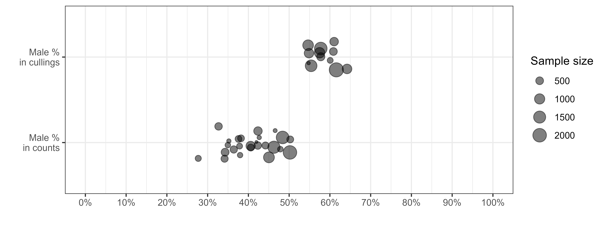

```{r setup, include=FALSE}
knitr::opts_chunk$set(echo = FALSE, 
                      warning = FALSE, 
                      message = FALSE, 
                      out.width = "100%", 
                      fig.align = "center",
                      fig.pos = 'H') # hold position / requires package "float"

Sys.setlocale("LC_ALL", "en_US.UTF-8")

```

\newpage

\linenumbers

# Introduction

Assessing population growth rate is a first step towards a better understanding of factors underlying the dynamics of natural populations [e.g. @Niel2005]. It is also crucial for measuring the efficacy of management actions potentially undertaken to help population recovery, control, or eradication [@Shea1998]. Among the approaches available to managers for reaching these goals, those relying on the monitoring of the number of individuals (counts) are by far the most popular [@Rintala2022]. In many instances, these methods enable investigating environmental factors underlying changes in population size, and hence help implementing mitigating actions [@Faillettaz2019]. Unfortunately, relying on the monitoring of population abundance alone generally hinders basic understanding of the demographic mechanisms underlying changes in population growth rates. More specifically, based on counts only, it is nearly impossible to assess the extent to which population growth rate is affected by changes in adult survival rather than to variations in productivity [@Austin2000], which is defined as the product of all reproductive parameters. To assess the relative sensitivity of population growth rate to factors affecting adult survival or reproductive parameters, demographers most often rely on the monitoring of individuals by capture-mark-recapture [CMR, @Lebreton1992]. In practice, however, one cannot always rely on the capture and release of individuals owing to the legal status of the species that precludes any additional disturbance (e.g. critically endangered species) or forbid the release of alive individuals (e.g. invasive species or pests). Furthermore, although highly efficient for assessing demographic parameters, capture-mark-recapture methods suffer from potential drawbacks such as being invasive (and may affect behaviour and hence survival or breeding success) and hardly affordable when time and money are limiting. Genetic monitoring is a non-invasive alternative to capture-mark-recapture, but it suffers from being costly and requires large samples [@Caniglia2011].

Most of the time therefore, managers do the best of a bad job using counts as a viable option for tracking population size changes and then population growth rate, in order to assess the relevance of management actions. Distinguishing immatures from adults in counts enables estimating adult survival rate, i.e. the proportion of breeders that survived over one year, and productivity/recruitment rate, i.e. the number of immatures produced per breeder that reach sexual maturity, which are, by definition, recruited in the breeding population. This additional effort makes it possible to assess the relative influence of each of these components on population growth rate. Alternatively, assessing the age structure in hunting bags has been used to infer the role of decreasing reproductive success in population declines in a number of games species including ducks and geese but suffers from intractable biases [@Fox2018]. Of course, the latter approach is not suited for protected/endangered species.

Here we exemplify how, in dimorphic species, delayed maturity of males can be used for estimating adult survival and recruitment rate by differentiating male-like from female-like individuals in repeated winter counts. We used two non-native Ruddy duck (*Oxyura jamaicensis*) populations introduced in Europe as a study model. As numerous duck species, Ruddy duck is dimorphic, with newly born males looking like females until the prenuptial moult, which occurs in late winter. As a result of this late prenuptial moult of immatures, the apparent proportion of males increases over the course of the wintering season. These changes in apparent proportions of males during this period are therefore directly related to the proportion of immatures into the populations and thus to the reproductive success of the previous breeding season. We estimated adult survival and recruitment rates and assessed the impact of two different eradication strategies deployed in Great Britain and in France, respectively.

# Materials & methods {#MM}

The Ruddy duck is a stiff-tailed duck native from the Americas. From seven individuals initially acclimated in the Slimbridge Wetland Centre in the 1940's [@GutierrezExposito2020], a feral population began to establish in Great Britain with the first observed reproductive attempts in the wild in the 1960's (Figure \@ref(fig:count)). This feral population rapidly grew and spread to the entire country to reach more than 5,000 individuals in the early 2000s. By the end of the 1980's, a feral population began to establish also on the continent, especially in France, supposedly owing to the arrival of individuals born in Great Britain. But contrary to what was observed in Great Britain, the Ruddy ducks did not spread much in France, with the vast majority of observations and breeding attempts clustering in the North-West of the territory. In France, during winter, almost no Ruddy duck is observed outside the lake of Grand Lieu (47.09°N, 1.67°W), which greatly facilitates the monitoring of this population. Ruddy ducks are considered as a major threat to the endangered native White-headed duck (*Oxyura leucocephala*) of the South-Western Mediterranean, because of hybridization and thus an elevated risk for genetic pollution and genetic assimilation of the latter by the former [@MunozFuentes2007]. In order to mitigate the risks of genetic pollution of the White-headed duck by Ruddy ducks, eradication measures were implemented in the late 1990's both in Great Britain and in France [@GutierrezExposito2020], and were followed by a European Ruddy duck eradication plan in 1999 [@Hughes1999] (Figure \@ref(fig:count)).

The trends and status of populations of both White-headed duck and Ruddy duck are being assessed through population censuses only. It is thus impossible to assess the factors that impair recovery of the former and the efficacy of the eradication program for the latter. In particular, based on censuses alone, one cannot assess the relative effects of changes in adult survival and recruitment rates on population growth rates which are prerequisites to identifying limiting factors.

```{r count, fig.cap = "(ref:count)"}

```

Like many other ducks, Ruddy ducks and White-headed ducks both display delayed dichromatism thereby young males acquire the typical colourful plumage of their kind, and hence can be distinguished from females, over the course of the interbreeding season, typically by mid-winter for the earliest individuals [@Baldassarre2014]. Delayed dichromatism generally explains the discrepancies in the estimates of apparent proportions of males counted in winter vs counted in spring, or vs males determined from individuals culled in winter (Figures \@ref(fig:flock) & \@ref(fig:pmal)).

Interestingly, delayed dichromatism enables estimating adult survival and recruitment/productivity by monitoring the seasonal evolution of apparent sex ratio and by making few and reasonable assumptions (see next section).

<!-- Interestingly, delayed dichromatism allows estimating the proportion of immature males, which is the difference between the proportion of female-like individuals between winter and spring. The proportion of all immature individuals is twice this value if we assume an even sex ratio at birth [@Bellrose1961; @Blums1996] and comparable mortality rates between immature females and immature males [@Ramula2018; @Wood2021]. The proportion of immatures can even be estimated only from winter counts by making the assumption of a known and unchanging adult sex ratio over the monitoring period [@Devineau2010], as developed inhere. By combining this proportion of immatures to reliable counts over two successive winters, both adult survival rate and recruitment rate can be estimated. -->

```{r flock, fig.cap = "(ref:flock)"}
knitr::include_graphics("../Output/flock.png")
```

```{r pmal, fig.cap = "(ref:pmal)"}

```

We monitored the demography of Ruddy duck populations in both Great Britain (GB) and France (FR) using exhaustive counts on the wintering grounds during the period between December 1 and January 31. In addition, apparent sex ratios in winter could be accessible from counts that distinguished female-like from male-like individuals in winter. Such counts were performed from 2006 to 2012 in Great Britain, which corresponded to a period of strong decline of the population (Figure \@ref(fig:count)). In France, a monitoring accounting for apparent sex was performed in 1999, 2001-2009, and 2012-2019. The French population observed a rapid growth during the first years of the monitoring and then stabilized from 2006 onwards as a result of a high culling pressure. In both countries, shooting was performed under the strict control of the authorities, meaning that the exact number of individuals culled was known. Therefore, despite the age ratio in birds shot was not ascertained before 2009 in France, it is possible to grossly qualify the culling pressure in three categories for both countries: "no culling" before 1999, "low culling" between 1999 and 2005, and "high culling" from 2006 (see Figure \@ref(fig:sup) in Supplementary Material).

## Inferring adult survival and recruitment rates from changes in population size and proportion of immatures

The proportion of immature males is the difference between the proportion of female-like individuals between winter and spring. The proportion of all immature individuals is twice this value if we assume an even sex ratio at birth [@Bellrose1961; @Blums1996] and comparable mortality rates between immature females and immature males [@Ramula2018; @Wood2021]. However, counts in spring suffer from inextricable issues, such as a differential detectability between females and males. Fortunately, the proportion of immatures can also be estimated only from winter counts by making the assumption of a known and unchanging adult sex ratio over the monitoring period [@Devineau2010].

The adult sex ratio is a prerequiste to estimate the proportion of immatures. No counts differentiating males from females were available during the breeding period to estimate adult sex ratios, but we determined the sex of each adult that was shot as part of the eradication programme both in Great Britain and in France. Nevertheless, the small number of culled individuals in France prevented from getting robust adult sex ratios. In Great Britain, the adult sex ratio estimated from the analysis of birds shot did not differ among months, so data from adults collected over the whole biological cycle were pooled to estimate adult sex ratios. The proportion of males did not statistically differ between the different years with more than 500 adults shot. This is consistent with previous findings showing that adult sex ratios in ducks are usually highly stable over the short-term [@Wood2021] but may vary over the long-term. Therefore, we pooled data from all adults shot as part as the control programme to estimate the adult sex ratio, see Equation \@ref(eq:pm).

Assuming the additive property of the binomial distribution, the proportion of immatures in a population can be deduced from the proportion of males in adults (alternatively the adult sex ratio) and the proportion of male-like individuals in the different count surveys in winter (assuming all these individuals are adult males), see Equation \@ref(eq:pic). By combining the population growth rate, which is derived from the year-to-year variation of an index of abundance of population size, to the proportion of immatures, one can derive adult survival and recruitment rates, see Equation \@ref(eq:vr) and Figure \@ref(fig:outline). A key concept is that if the absolute value of population size is known, numbers of adults and recruits can be estimated, see Equation \@ref(eq:VR).

| Variable name         | Description                                                                                                |
|:-|:-------|
| *Observation (input)* |                                                                                                            |
| $AM$                  | Total number of adult males shot as part of the eradication programme                                      |
| $AF$                  | Total number of adult females shot as part of the eradication programme                                    |
| $CML_{i, t}$          | Number of male-like individuals counted in population $i$ in year $t$                                      |
| $C_{i, t}$            | Number of individuals counted in population $i$ in year $t$                                                |
| $N_{i, t}$            | Size of the population $i$ in year $t$ (maximum number of individuals counted in the wintering population) |
| *Parameter (output)*  |                                                                                                            |
| $p(m|a)$              | Proportion of males in adults (or probability of being a male knowing it is an adult)                      |
| $p(a \cap m)_{i, t}$  | Proportion of adult males in population $i$ in year $t$                                                    |
| $p(a)_{i, t}$         | Proportion of adults in population $i$ in year $t$                                                         |
| $p(re)_{i, t}$        | Proportion of immatures/recruits in population $i$ in year $t$                                             |
| $s_{i, t}$            | Adult survival rate, i.e. proportion of individuals in year $t-1$ still alive in year $t$                  |
| $r_{i, t}$            | Recruitment rate, i.e. number of recruits in population $i$ in year $t$ per individual in year $t - 1$     |
| $S_{i, t}$            | Number of adults in population $i$ in year $t$                                                             |
| $R_{i, t}$            | Number of recruits in population $i$ in year $t$                                                           |

```{=tex}
\begin{equation}
p(m|a) \sim {\sf Beta}(AM, AF)
(\#eq:pm)
\end{equation}
```
```{=tex}
\begin{align}
CML_{i, t} & \sim {\sf Binom}(p(a \cap m)_{i, t}, C_{i, t}) \notag \\
& \sim {\sf Binom}(p(m|a).p(a)_{i, t}, C_{i, t}) \notag \\
& \sim {\sf Binom}(p(m|a).(1 - p(re)_{i, t}), C_{i, t})
(\#eq:pic)
\end{align}
```
```{=tex}
\begin{equation}
\begin{aligned}
s_{i, t} & = \frac{N_{i, t}}{N_{i, t - 1}}.(1 - p(re)_{i, t}) \\
r_{i, t} & = \frac{N_{i, t}}{N_{i, t - 1}}.p(re)_{i, t}
\end{aligned}
(\#eq:vr)
\end{equation}
```
```{=tex}
\begin{equation}
\begin{aligned}
S_{i, t} & = N_{i, t}.(1 - p(re)_{i, t}) \\
R_{i, t} & = N_{i, t}.p(re)_{i, t}
\end{aligned}
(\#eq:VR)
\end{equation}
```
```{r outline, fig.cap = "(ref:outline)"}
knitr::include_graphics("../Output/outline.png")
```

## Validating the method {#VAL}


Nevertheless, we developed an indirect approach to estimate the maximum expected recruitment rate without exploitation and assuming that the observed density levels did not affect components of the recruitment process. Estimated values above that maximum recruitment rate would reflect failure in detection of adult males. On the other hand, null or negative recruitment rates would reflect either that immature males had acquired the male plumage before the survey, or violation of the assumption about the stability of the adult sex ratio.

Practically, maximum recruitment rate is estimated from the difference between maximum growth rate and maximum adult survival rate, see Equation \@ref(eq:GR). This relationship comes from a simple reasoning for a closed population: population size in year $t$ is equal to the number of adults that survived over year $t - 1$ plus the offspring produced in year $t - 1$ that survived until the reproduction period of year $t$, i.e. the recruitment in year $t$ [@Flint2015]. For an open population, adult survival and recruitment rates are confounded to adult and recruit migrations, respectively, but this does not corrupt the equation. This relationship becomes more complex if a species with delayed maturity is considered, see @Robertson2008.

| Variable name | Description                                                                                 |
|:-|:---------|
| $N_{t}$       | Number of adults in year $t$                                                                |
| $D_{t}$       | Number of adults dead during year $t$                                                       |
| $R_{t}$       | Number of recruits in year $t$                                                              |
| $s_{t}$       | Adult survival rate, i.e. proportion of individuals in year $t-1$ still alive in year $t$   |
| $r_{t}$       | Recruitment rate, i.e. number of recruits in year $t$ produced per individual in year $t-1$ |
| $\lambda_{t}$ | Growth rate of the population between year $t-1$ and year $t$                               |

```{=tex}
\begin{align} 
N_{t} & = N_{t-1} - D_{t-1} + R_{t} \notag \\
N_{t} & = N_{t-1} - (1 - s_{t}).N_{t-1} + r_{t}.N_{t-1} \notag \\
N_{t} & = s_{t}.N_{t-1} + r_{t}.N_{t-1} \notag \\
\frac{N_{t}}{N_{t-1}} & = s_{t} + r_{t} \notag \\
\lambda_{t} & = s_{t} + r_{t} \notag \\
r_{t} & = \lambda_{t} - s_{t}  
(\#eq:GR)
\end{align}
```
Maximum adult survival was defined as a uniform distribution on the $[0.7;1]$ interval. The lower limit corresponded to the upper range of survival rates observed in waterfowl species of similar weight, and the upper limit was set to 1 because survival rates of long-lived waterfowl species are very high [@Nichols1997; @Krementz1997; @Buxton2004; @Nichols1992; @Koons2014].

In both populations, the maximum growth rates occurred during their geographical expansion phase before shooting operations (Figure \@ref(fig:count)). To estimate robust maximum population growth rates for both populations, we smoothed annual growth rate values over a consistent time-period by using a linear regression on the logarithm scale, see Equation \@ref(eq:L). We discarded Great Britain data before 1972 as the estimates were probably noisy when the population was low (below 50 indiviudals) (Figure \@ref(fig:count)). After reaching the threshold of 1,000 individuals, the Great Britain (GB) population growth showed a strong inflexion despite culling had not begun (Figure \@ref(fig:count)). This observation suggests that a negative density-dependence process might occur beyond 1,000 individuals and led to consider only the first sequence of the time series to infer on the maximum growth rate in Great Britain, i.e. 1972-1981. For the French (FR) population, the sequence without culling pressure spread over the period 1994-1999.

| Variable name    | Class     | Description                                                                                              |
|:-|:-|:--------|
| $N0_{i, J}$      | Parameter | Intercept of the regression model                                                                        |
| $\lambda_{i, J}$ | Parameter | Average population growth rate over a restricted time interval $J$ for a population $i$ (in $year^{-1}$) |
| $t \in J$        | Index     | Year index within the time interval $J$                                                                  |
| $\sigma_{i, J}$  | Parameter | Standard deviation of the regression model                                                               |

```{=tex}
\begin{equation}
log(N_{i, t}) \sim {\sf Norm}(N0_{i, J} + log(\lambda_{i, J}).t, \sigma_{i, J})
(\#eq:L)
\end{equation}
```
Estimating vital rates within an acceptable range, as defined above, would not prove that out modelling approach correctly tracked their year-to-year variability. In order to ascertain this aspect, we check the correlation between the proportions of immatures and both survival and recruitment rates derived from counts, to estimates derived from cullings, i.e. from individuals shot as part of the eradication programme. As we restricted the dataset to years with more than 100 individuals shot in winter for sake of precision, the analysis covered only five years of the time series of the GB population. Proportions of immatures were estimated from culled individuals by checking the presence of the bursa of Fabricius, which is present in immature individuals only [@Hochbaum1942]; see Equation \@ref(eq:pis). Adult survival and recruitment rates were then estimated by combining the proportion of immatures and Equation \@ref(eq:vr).

| Variable name | Class        | Description                                                              |
|:-|:-|:--------|
| $SI_{i, t}$   | Observation  | Number of immatures culled in the wintering population $i$ in year $t$   |
| $S_{i, t}$    | Observation  | Number of individuals culled in the wintering population $i$ in year $t$ |

```{=tex}
\begin{equation}
SI_{i, t} \sim {\sf Binom}(p(re)_{i, t}, S_{i, t})
(\#eq:pis)
\end{equation}
```
## Assessing the impact of culling strategies {#HARV}

During period when culling pressure was high (i.e. from 2006 onwards), eradication strategies differed between Great Britain and France. In Great Britain, culling mostly occurred in winter (53.4% of adults were shot before the 30th May), whereas it was mostly done during the breeding period in France (81.6% of adults were shot after the 30th May). We assessed whether or not these strategies had a different impact on populations by comparing growth rates and the relative contributions of both recruitment and survival on them (by comparing the average values over the high culling pressure period to proxies of maximum vital rates estimated when both populations reached their maximum growth, see Section \@ref(VAL)). In France, a LIFE project was implemented by early 2019 to intensify the culling pressure, especially during winter and spring. We therefore excluded the FR time series from 2019 onward in order to provide a comparison of homogeneous culling strategies.

## Statistical framework

We used the Bayesian framework to implement all sub-models presented in Section \@ref(MM). The Bayesian framework is both straightforward and efficient to propagate error through the parameters. We used uninformative priors on all parameters. As the maximum growth rate is a life history trait expected to be stable among populations of a same species, we used an uninformative hierarchical prior for this parameter. We generated three chains of length 500,000, with a thinning of 10 to avoid autocorrelation in the samples, discarding the first 2,000 samples as burn-in. We assessed chain convergence using the Gelman and Rubin convergence diagnostic (R\<1.1, @Gelman1992). Models were fitted using NIMBLE [@Valpine2017] run from R [@RCT2022]. The values **X[Y; Z]** reported in Section \@ref(RES) are the medians and the associated boundaries of the 95% confidence interval of posterior distributions. We preferred the median to the mean because of its robustness to skewed distribution.

# Results {#RES}

## Estimating vital rates

The method successfully provided estimates and associated uncertainty for the proportion of immatures in both wintering populations. Similarly, adult survival and recruitment rates, i.e. the two components accounting for population growth rate, were also properly estimated (Figure \@ref(fig:vital)).

```{r vital, fig.cap = "(ref:vital)"}
knitr::include_graphics("../Output/plot_paper_3.png")
```

The proportion of males in adults, which is a prerequisite to infer the proportion of immatures, was estimated at 0.60 [0.59; 0.61]. The proportion of immatures ranged from 0.16 [0.07; 0.24] to 0.54 [0.44; 0.62], depending on population and year. The lowest values were similar for the two populations, but the range of the proportion of immatures in the GB population was far more limited (upper value GB: 0.30 [0.14; 0.45] & FR: 0.54 [0.44; 0.62]). The proportion of immatures was stable over time in the GB population, while a slight but significant decrease was observed for the FR population.

Adult survival rate ranged from 0.33 [0.29; 0.37] to 1.01 [0.89; 1.14]. None of the estimates was significantly outside the range of a survival rate defined without immigration [0; 1]. No trend in adult survival rate could be evidenced in any of the two populations, but patterns differed: adult survival in GB was both lower and displayed a weaker inter-annual variability than in FR.

Recruitment rate ranged from 0.09 [0.04; 0.13] to 0.75 [0.63; 0.87]. All estimates were above 0, that is not incompatible with reality. Moreover, the maximum recruitment rate was 0.68 [0.36; 0.78] (see Section \@ref(MAX)), and no estimates were significantly outside the range of recruitment rates defined without immigration [0; 0.78]. No trend was observed for the GB population, but recruitment rate decreased for the FR population even if it was more noisy than for the proportion of immatures. Like for survival, the GB population had lower values of recruitment rate with weaker variability than the FR one.

Lower values and weaker variability of both adult survival and recruitment rates estimated in GB than in FR likely explained the differing trajectories of the two Ruddy duck populations, a sharp and constant decline for the former vs slow and variable decline for the latter (Figure \@ref(fig:count)).In the FR population, the range in recruitment rates (min/max difference: 0.66) was higher than the range of survival rates (min/max difference: 0.58). Conversely, the range of survival rates (min/max difference: 0.46) in the GB population was far higher than the range of recruitment rate (min/max difference: 0.08). This suggests that the variability of population growth rate was mostly driven by recruitment in FR whereas it was mainly driven by changes in adult survival in GB.

## Examining the reliability of the estimates

In Great Britain, proportions of immatures derived from the count-based method were positively correlated to those observed from culled individuals (Figure \@ref(fig:cor)). Therefore, this result supports the hypothesis that the proportion of female-like individuals in the wintering populations is efficient for assessing age structure and hence reproductive output. The correlation was even stronger when considering vital rates (Figure \@ref(fig:cor)), but this was expected because the two methods estimating these vital rates shared a component, the growth rate of the population (see Equation \@ref(eq:vr)). Interestingly, a 1:1 correlation is never reached for any parameters. The proportion of immatures derived from counts is always lower than those observed in culled individuals. The discrepancy between these two estimates is due to the fact that immatures are probably more vulnerable to culling than adults and might then be over-represented in culling samples. As a consequence, the correlation coefficients for both vital rates also differed. However, the differences between the two approaches do not question the ability of the count method to track the interannual variability of the vital rates.

```{r cor, fig.cap = "(ref:cor)"}
knitr::include_graphics("../Output/plot_paper_4.png")
```

## Assessing the demographic response to culling strategies {#MAX}

When culling pressure was nil, maximum growth rates were very similar for the two populations (Figure \@ref(fig:mgr)), respectively 1.45 [1.36; 1.55] and 1.52 [1.25; 1.88] for GB and FR. These values corresponded to a population increase of 45% and 52% per year, respectively. Assuming a maximum adult survival rate of 0.85 [0.7; 1] identical for both populations, we deduced maximum recruitment rates of 0.60 [0.42; 0.78] and 0.68 [0.36; 1.06] respectively for GB and FR.

Despite low sample sizes of sexed and aged culled individuals, proxies of the culling pressure exhibited significant changes over time (Figure \@ref(fig:sup)). We thus ranked the culling pressure according to this intensity. High culling pressure occurred from 2006 onwards in both populations (although the signal was noisy). However, despite similar levels of culling pressure, the culling strategies differed significantly between the two populations, see Section \@ref(HARV). Under high culling pressure, the growth rate dropped to 0.56 [0.53; 0.59] and 0.97 [0.94; 1.00] for GB and FR, respectively, which corresponded to a decrease of 44% per year and 3% per year. This result showed that the GB population significantly decreased during the high culling pressure, whereas the FR population was just stabilized.

Adult survival rate under high culling pressure was 0.44 [0.42; 0.46] and 0.62 [0.59; 0.64] for GB and FR, respectively, and recruitment rates decreased to 0.13 [0.11; 0.15] and 0.32 [0.29; 0.34], respectively. The resulting drop in growth rate of the GB population corresponded to a similar average drop in adult survival rate (-0.41) and in recruitment rate (-0.47), whereas the stabilisation of the FR population was more caused by a decrease of recruitment rate (-0.36) than by a drop in adult survival (-0.23). Overall, culling strategy adopted in GB was more effective in affecting both adult survival and recruitment rates than that adopted in FR.

```{r mgr, fig.cap = "(ref:mgr)"}
knitr::include_graphics("../Output/plot_paper_5_saved.png")
```

# Discussion

Disentangling the contribution of the vital rates to population growth rate is a key step towards a better understanding of the response of a population to management actions [@Williams2002]. We exploited delayed sexual dichromatism to develop a new approach based on counts to breakdown the apparent growth rate of a population into two of its main structural components: adult survival and recruitment rates. The development of the "apparent sex ratio" method holds on a unique dataset of two comparable populations of the same species, the Ruddy duck. Both populations were monitored in a similar way from their introduction to a period of intense culling pressure, but the culling strategies differed sharply. The very similar demographic trajectories and properties of both populations in similar ecological setup enabled evaluating the response to both culling pressure and culling strategies.

## Monitoring adult survival and recruitment rates

For the two populations, the vital rate estimates were within the same range, which demonstrates a certain consistency in the results obtained from the method. The greater variability observed for the FR population was expected because the time series covered a larger spectrum of culling pressure than the GB one. We did not detect temporal correlation in the demographic parameters between the two populations, suggesting that regional (e.g., weather) rather than large-scale factors (e.g., climate) prevailed. This is consistent with previous findings showing for example that in waterfowl, both breeding success and juvenile survival are conditional to the onset of laying, which is tightly related to local weather (e.g. spring temperature, cumulative rainfall, water levels) [@Folliot2017; @Blums2004; @Dzus1998], and to local changes in predation pressure [@Jaatinen2022].

Count surveys used to implement our model occurred in mid-winter, that is when some immature males might initiate their moult. This could partially violate the assumption that male-like individuals were adult males only, and hence potentially bias our estimates. Nevertheless, as survival estimates are within the range of those reported for similar species [@Nichols1997; @Krementz1997; @Buxton2004; @Buderman2023], the assumption seems reliable. Therefore, the time window of the count surveys must be chosen with care to fit the time preceding the initiation of moult of immature males.

In some years, the estimated values of adult survival were outside the range of expected values even if they never significantly exceed 1. One possible explanation for these discrepancies is a violation of the "closed population" assumption. Indeed, despite ringing data suggest that Ruddy ducks do not undertake long-distance seasonal movements in GB (Henderson, pers. com.), one cannot totally rule out that immigration occurred. The out of range outliers of both recruitment and survival rates that were observed in 2002 and 2012 in FR suggest then significant immigration events during these years.

The theoretical maximum population growth rate is an inherent trait related to the demographic characteristics of a species [@Dmitriew2010; @Niel2005]. This trait is expected to be similar in all Ruddy duck populations anywhere in the world. In our study, we observed maximum growth rates that were very close for the two populations, which was expected because both populations experienced similar ecological conditions with an absence of harvesting and similar breeding conditions. Moreover, before the launch of the eradication programmes, the two populations also expressed a population growth much closer to the maximum expected values than any other native ducks species at the same period in the same areas. In the absence of culling, both populations expressed survival rates in the upper range of those observed in other diving ducks species (e.g. \~ 0.8 for Common pochard [@Folliot2020; @Nichols1997]). Ruddy duck tend to breed latter than both Common pochard and Tufted duck, yet nest predation has been found to decrease over the breeding season in a French fishpond complex [@Bourdais2015]. Therefore, both enhanced survival and nesting success might have accounted for high population growth rates of Ruddy duck populations in the absence of culling. Besides providing estimates of adult survival and recruitment rates that were consistent with observed increasing population sizes, our method also provided estimates consistent with both the decreasing phases occurring after the implementation of eradication programmes and the observed differences in populations growth rates under differing culling strategies. As expected, higher values of survival and recruitment rates were observed when the culling strategy focused on post-breeding season rather than the pre-breeding one.

Assuming that culling data provide a good picture of the year-to-year variability of age structure [@Fox2014], the strong correlation between estimates derived from counts and those derived from culled individuals demonstrates the ability of the "apparent sex ratio" method introduced here to properly track inter-annual fluctuations in demographic parameters such as survival and recruitment rates. The fact that the observed correlation was strong despite being based on a short time series strengthens its robustness. Furthermore, the strength of the relationship between parameters obtained through the two approaches also supports that important assumptions of our model were met, such as constant adult sex ratio. The temporal autocorrelation of the adult sex ratio might be explained by the fact that it integrates many age-cohorts, which makes it structurally strong. Significant variations of the adult sex ratio can occur over the long term, but our results suggests that it is not necessary to monitor and update it on a yearly basis. Proportions of males in adults estimated in the present paper (i.e. 0.60) are within the range of those observed in native Ruddy duck populations of North America (0.62 in @Bellrose1980) and in other duck species [@Wood2021]. The "apparent sex ratio" method always provided recruitment rates significantly lower than the method based on culling data by a factor close to two, a result that is compatible with a higher vulnerability of the immatures to shooting [@Fox2014]. For instance, in North America, immatures have been found to be 1.3 to 2.6 times more vulnerable to hunting than adults in waterfowl [@Bellrose1980].

Because estimates of survival were not available in the literature (see @Buderman2023), we could not properly assess the accuracy of the "apparent sex ratio" method for estimating this parameter. Nevertheless, circumstantial evidence support that the method is not heavily biased as detailed above. Thus the "count-changing sex ratio" method would be much more efficient for monitoring key demographic parameters than alternative methods such as those based on culling/hunting bag data that proved unreliable [@Fox2014], even when they focused on the end the hunting season to limit possible biases [@Fox2016].

## Assessing eradication strategies

Both populations responded to culling pressure by a significant decrease in their growth rate, meaning that increasing mortality due to culling was neither compensated by increasing natural survival nor by improved breeding success. The culling effort was therefore efficient to affect the demographic trajectory of Ruddy duck in both contexts. However, the decrease in population growth was much stronger in GB, where the population displayed a sharp decrease, than in FR where the increase was stopped and population size remained more or less stable. The greater decline in population growth observed in GB compared to FR was due to greater decline in both adult survival and recruitment rates. Overall, in both countries, adult survival and recruitment rates seemed significantly affected by culling. However, the culling pressure occurring before the breeding season, which affect only future breeders (pre-breeding culling strategy applied in GB), seemed much more efficient in limiting both survival and recruitment rates than the culling pressure occurring during nesting and young raising, which targets breeders and newly born individuals (breeding culling strategy applied in FR).

As expected, the pre-breeding culling strategy had the same effect on adult survival and recruitment rates because a bird killed before the breeding period reduces the breeding population (lower adult survival rate) and prevents this bird from reproducing (lower recruitment rate). When the breeding culling strategy was applied, the recruitment rate was more affected than adult survival. This was probably due to immatures being much more vulnerable to shooting than adults [@Bellrose1980; @Fox2014]. The compensation hypothesis suggests that the higher harvest mortality of immatures can be compensated by increasing natural survival [@Cooch2014] but it is not supported by the observations. Overall, there was no evidence for any compensation mechanism in either context. This might result from the fact that both populations were far of reaching carrying capacity meaning that competition for resources was relaxed [@Peron2013].

For more or less comparable culling pressure, the pre-breeding culling strategy proved much more effective. This does not mean however, that the breeding culling strategy was not so. On the contrary, it proved rather efficient for stopping both the population increase and range expansion in a first time, and in second time to trigger a significant population decline by slightly increasing culling pressure. Thus when winter culling is not possible, which was the case in FR, culling during the breeding season is effective for stopping or reversing population increases in such species. The breeding culling strategy is however affected by the highly variable detectability of immatures, as these individuals colonise new ponds. This results in fluctuations of the recruitment rate and then threatens the long term efficiency of such strategy. The winter culling strategy does not face such problem because of the habit of Ruddy ducks to gather in a limited number of sites during winter [@Johnsgard1996].

The response of the two Ruddy duck populations to culling pressure demonstrates the necessity to account for the culling season to produce proper predictions. Predicting the impact of a harvest pressure on a waterfowl population is then not only a question about how big is the harvesting effort, but also when harvesting occurs [@Kokko1998]. Counter-intuitively, our results suggest that harvesting waterfowl during breeding has far less impact on population growth rate than harvesting during winter. As a result, a target for effective management of harvested waterfowl should be earlier onsets and endings of hunting seasons.

## Waterfowl management implications

One major implication of our study concerns the timing of harvesting for limiting its impact on populations growth rate. Counter-intuitively, our results show that the persistence of waterfowl populations should benefit from earlier openings and closings of the hunting seasons (see above).

Tracking variations in abundance is a common tool to determine the conservation status of a population [e.g @Folliot2022]. But tracking abundance alone does not provide enough information for assessing the underlying mechanisms behind the changes of population growth [@Williams2002]. In order to do that, one must “dig deeper” [@Austin2000], for example by monitoring individuals to assess parameters like survival and recruitment rates [e.g. @Arnold2018]. However, monitoring individuals is time consuming [e.g. @Souchay2016] and not always possible in endangered species. The method proposed here allows circumventing these drawbacks in dichromatic species with delayed maturity of males. Among these species, one can mention the White headed duck in Southern Spain, which is highly endangered and cannot be safely monitored through capture-mark-recapture. Thus by improving census strategies and teasing apart the effects of variations of adult survival and productivity on population growth through the approach presented here, one could gather much more invaluable information about the pertinence of management strategies. 

<!-- The immature proportion, alternatively the age ratio, is commonly used to describe the renewal capacity of a waterfowl population and to track the changes of its productivity [@Smith2001; @Bellrose1980; @Robertson2008; @Rodway2015; @Zimmerman2010]. The recruitment rate however remains a better indicator than the immature proportion/age ratio, the latter only having the advantage of being more directly accessible. Indeed, the immature proportion/age ratio does not account for the dynamics of the population and reflects the population productivity only if the population growth is steady. For instance, let us consider a breeding population of 100 individuals reaching 100 individuals the next year, which then drops to 60 individuals the second year. If there are 50% immatures each year, corresponding to a 1:1 age ratio, we may be tempted to conclude that the productivity is stable over time. But it actually corresponds to a strong decrease of the productivity (-40%) because the recruitment rate evolved from 0.5 recruits per breeder the first year to 0.3 recruits per breeder the second year. This demonstrates that the immature proportion/age ratio suffers from caveats that can be misleading for a manager. According to @Blums2004, recruitment in diving ducks is not related to fecundity, but depends mostly on juvenile survival, the other component of the recruitment that is mostly driven by weather conditions. Studies on other birds also conclude of the poor correlation between fecundity and recruitment [e.g. @Murray2000]. Fecundity alone does not provide all knowledge that is required for a manager to understand the dynamics of a population. -->

Finally, we want to stress the fact that the main aim of our approach was to decompose population growth into its two main components and not to provide unbiased estimates of adult survival or recruitment rates. However, if needed, censuses could be designed in such a way that would make this possible, at least in theory, and in species presenting an observable delayed dichromatism. This property concerns most stiff-tailed duck species [@Johnsgard1996], as well as numerous other duck species, among which Tufted duck, *Aythya fuligula*, Black scotter, *Melanitta nigra americana*, Common Goldeneye, *Bucephala clangula americana* [@Johnsgard1978; @Bellrose1980]. Modifying standard monitoring protocols to distinguish male-like from female-like individuals is almost costless but worth the bet because it would provide substantial increases in the efficiency of conservation/management actions [@Nichols2006].

# Acknowledgments {.unnumbered}

This work was partly funded by the LIFE Oxyura project (LIFE17 NAT/FR/000942) through the LIFE program. We warmly thank Jay McGowan for allowing us to publish his Ruddy duck photograph. This work was carried on with the impulse of Jean-François Maillard, and Jean-Baptiste Mouronval from the *Office Français de la Biodiversité*, and Jean-Marc Gillier from the *Société Nationale pour la Protection de la Nature*. The authors acknowledge all the contributors of the data collection; in Great Britain, Wildfowl & Wetlands Trust staff past and present, particularly Baz Hughes, Peter Cranswick and Colette Hall, and all the project workers at the Animal and Plant Health Agency and its predecessors; in France, Office Français de la Biodiversité staff past and present, especially Vincent Fontaine, Denis Lacourpaille, Agathe Pirog, Hugo Pichard, Justin Potier, Alexis Laroche, Médéric Lortion, Jules Joly, and Valentin Boniface, and the whole team of the Société Nationale pour la Protection de la Nature of the Grand Lieu lake.

\nolinenumbers

# References {.unnumbered}

::: {#refs}
:::

\newpage

# (APPENDIX) sup {.unnumbered}

# Supplementary Materials

```{r sup, fig.cap = "(ref:sup)"}
knitr::include_graphics("../Output/plot_paper_6.png")
```

(ref:count) Temporal changes in the number of Ruddy ducks (log scale) in Great Britain (GB) and France (FR) from 1960 to 2019, with indications of periods when apparent sex ratios were also recorded

(ref:flock) A Ruddy duck flock observed in winter including ten female-like individuals with a whitish striped cheek (some of which are immature males), four male-like individuals with a white cheek and a black cap (all adult males), three unidentified individuals (1^st^, 4^th^, and 10^th^ from left) © Jay McGowan - 3 February 2013 - Tompkins, New York, United States

(ref:pmal) Proportions of males estimated through the internal examination of individuals shot as part of the eradication programme over one year in a population (Male % in cullings) and proportions of individuals displaying a male-like plumage in a population counted in winter (Male % in counts); discrepancies between the two estimates are due to delayed dichromatism (immature males looking like females before moulting); we exploited these discrepancies for estimating survival and productivity/recruitment

(ref:outline) Outline of the method to disentangle the population growth into survival (adult survival rate) and productivity (recruitment rate)

(ref:vital) Temporal changes in the proportions of immatures and the vital rates following the culling pressure on Ruddy duck populations of Great Britain (GB) and France (FR); vertical bars represents the 95% confidence intervals.

(ref:cor) Relationship between parameter estimates derived from counts (count-based method) and those obtained from culled individuals (cull-based method); only five years were available for the GB population; bars represent 95% confidence intervals and the red arrow indicates the direction and average differences between the two methods

(ref:mgr) Average effects of culling pressure and different culling strategies (GB vs FR) on population growth rates (derived from counts only), and on adult survival and recruitment rates (derived from counts and apparent sex ratios); the culling pressure for the GB population moslty occurred during the prebreeding period, whereas it mostly focused during and after the breeding period for the FR population (see \@ref(HARV) for details); adult survival and recruitment rates under high culling pressure were averaged over a time-period observing a consistent culling pressure; vertical bars show 95% confidence intervals

(ref:sup) Definition of three periods of different culling pressures from an index based on an estimation of adult culling rate; as only half of the culled individuals were aged in France before 2009, we applied the average age ratio over 2009-2019 on unaged individuals to provide an estimate of the number of adults in cull data before 2009; culling rate increased over time, we therefore split the time series in three categories : we defined a "no culling" period before 1999 because the culling rate for both countries was mostly null and always below 10%, we defined a "low culling" between 1999 and 2005 because the culling rate varied around 20% for both countries, the culling rate then raised significantly for both countries, so we defined a "high culling" period from 2006 onwards
